# Java 字节码

## 查看字节码文件

字节码文件保存了源代码编译后的内容, 以二进制形式存储, 无法直接用记事本打开阅读, 使用 `CotEditor` 文本工具打开内容会有乱码, 如下所示:

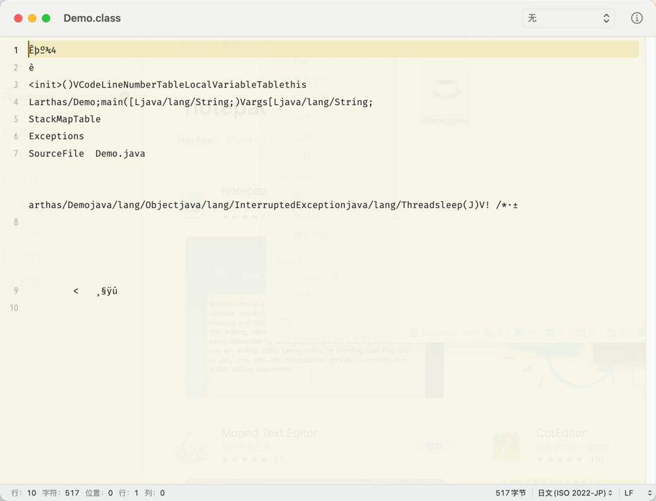

可以使用专门的字节码工具 [jclasslib](https://github.com/ingokegel/jclasslib), 也可以直接在 IDEA 中搜索该工具名称的插件直接使用, 基本界面如下所示:

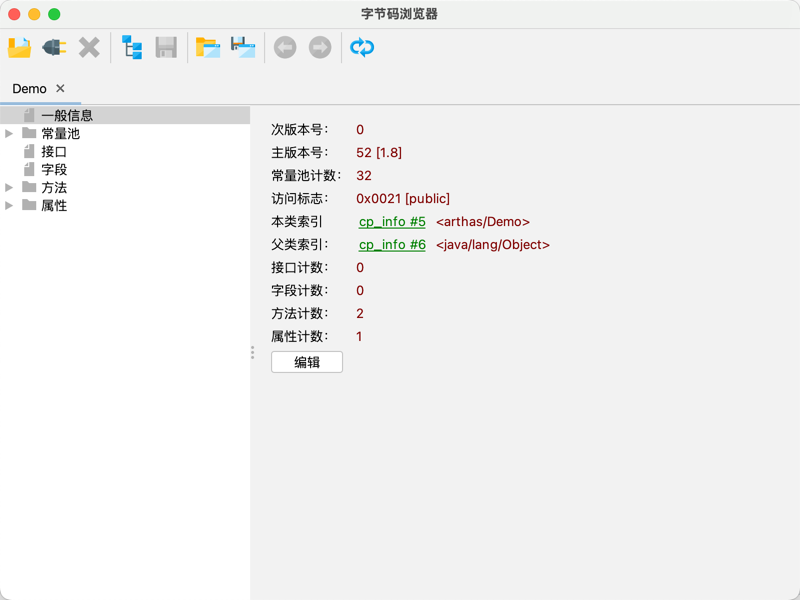

## 字节码文件组成

### 基础信息

包含魔数、字节码文件对应的 Java 版本号、访问标识、父类和接口等信息;

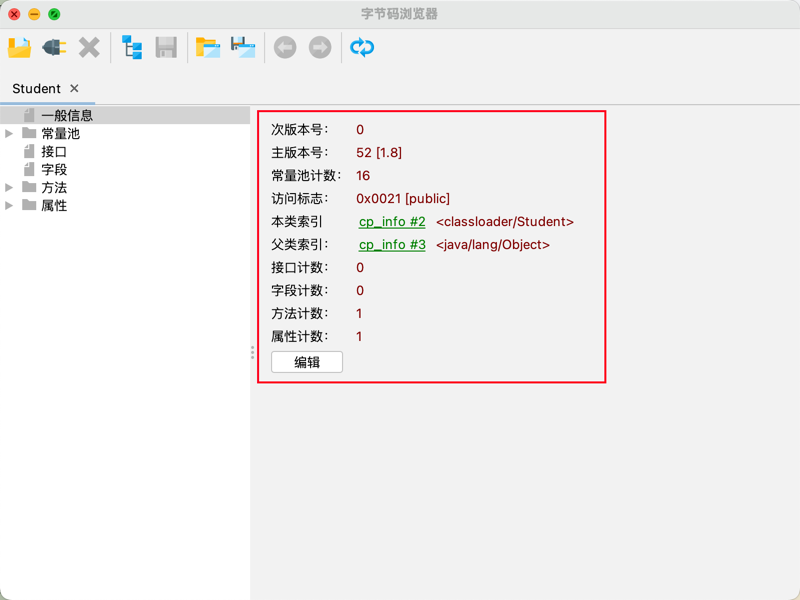

#### 魔数

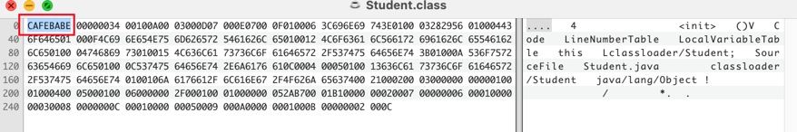

文件**无法通过文件扩展名来确定文件类型**, 文件扩展名可以随意修改, 不会影响文件的内容;

**软件是通过文件的头几个字节(文件头)校验文件类型**, 如果软件不支持该文件类型就会出错; 在 Java 字节码中, 将文件头称为 **magic 魔数**;

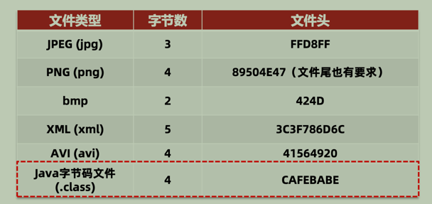

#### 主副版本号

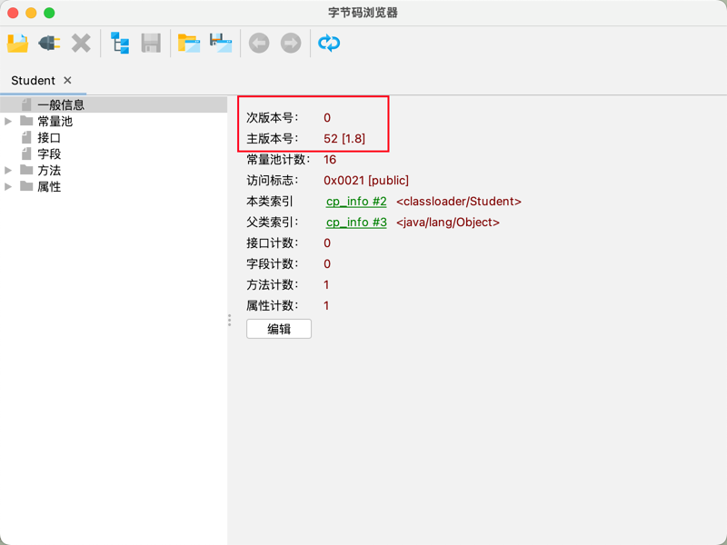

主**副版本号指的是编译字节码文件的 JDK 版本号**: 

- 主版本号标识大版本, JDK1.0-1.1 使用了 45-45.3, JDK1.2则是 46; 即没升级一个大版本就加 1;
- 副版本是当主版本号相同时, 作为区分不同版本的标识, 一般只关心主版本号;

版本号的作用主要是**判断当前字节码的版本和运行时的 JDK 是否兼容**;

> 1.2 之后的大版本号计算方法就是: 主版本号-44; 如主版本号为 52 就是 JDK8;

#### 其他信息

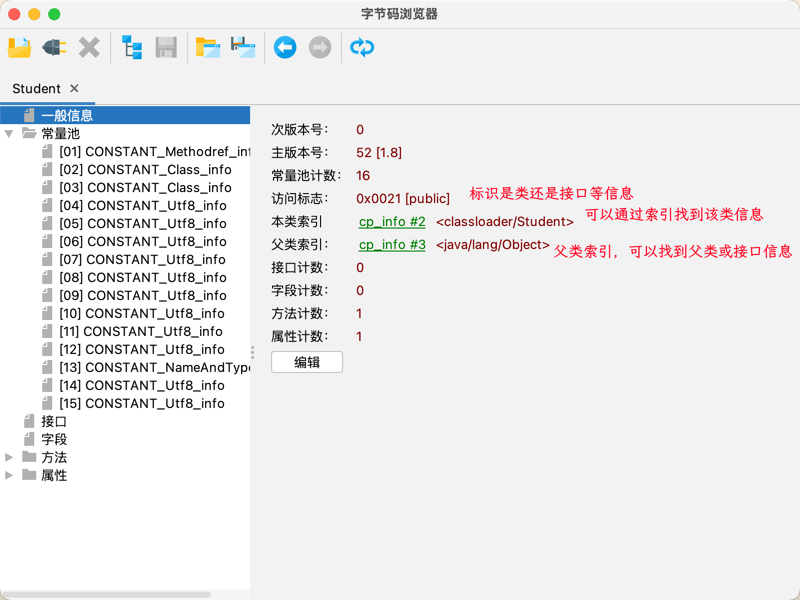

### 常量池和字段

常量池: 保存了字符串常量、类或接口名、字段名,主要在字节码指令中使用; 用于**避免相同的内容重复定义**, 节省空间;

字段: 当前类或接口声明的字段信息保存在字节码文件中;

如下所示, 虽然声明了两个内容一样的字符串, 但是在字节码文件中, 两个变量的值都是指向一个常量池中的字符串常量;
 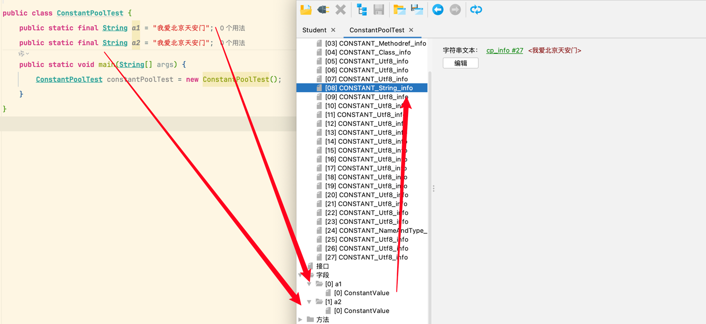

- 常量池中的数据都有一个编号, 编号从 1 开始; 在字段或字节码指令中通过编号可以快速找到对应数据;
- 字节码指令中**通过编号引用到常量池**的过程称之为**符号引用**;

### 方法

字节码中的方法区域是**存放字节码指令的核心位置**, 字节码指令的内容存放在方法的 Code 属性中;

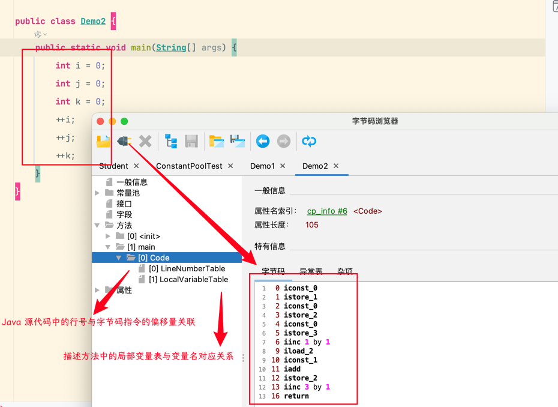

方法分析示例 1:

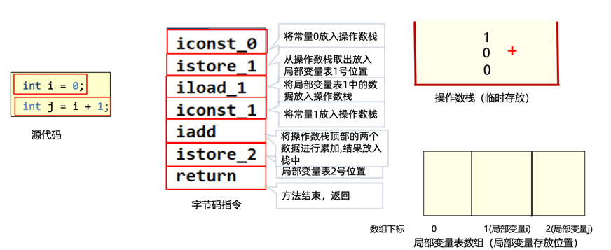

方法分析示例 2: 

> 最终 i 的值为 0

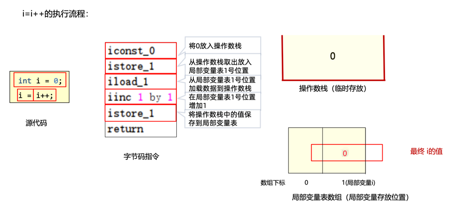

### 属性

类的属性, 比如源码的文件名、内部类的列表等;

## Java 字节码常用工具

### Java 命令

> 使用 javap -v 命令;
> 
> 

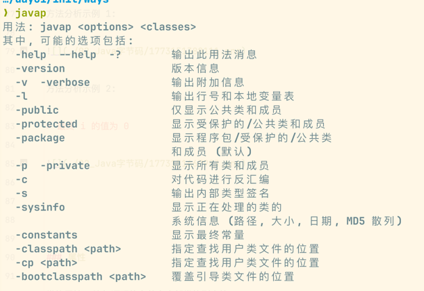

javap 是 JDK 自带的反编译工具, 可以通过终端查看字节码文件的内容; 如下所示:

> 如果是查看 jar 包, 可以通过 `jar -xvf 文件名` 解压;

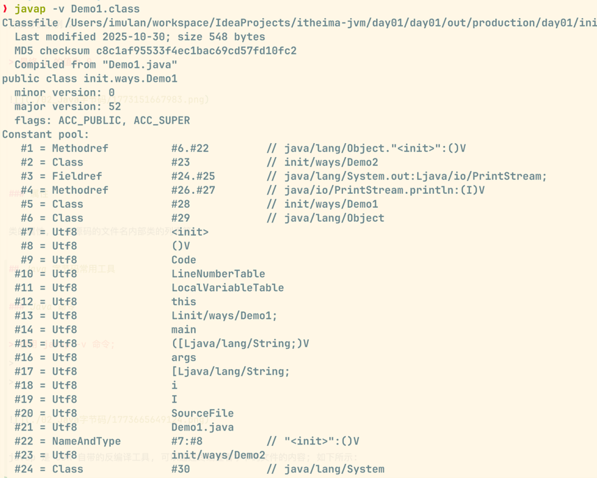

### jclasslib 插件

在 idea 直接直接下载安装即可; 安装后在【视图】中找到打开字节码即可;

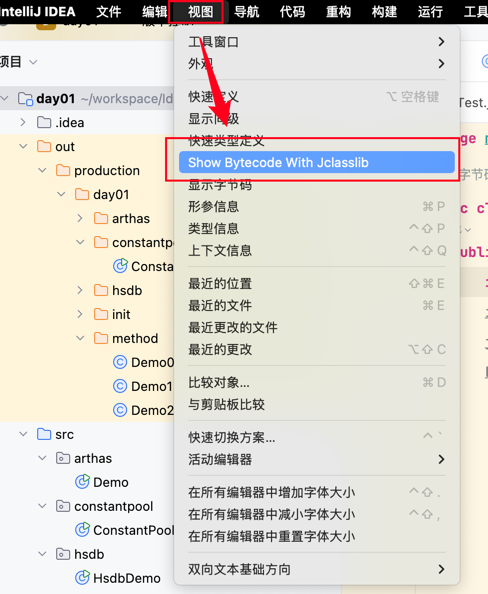

### 阿里 arthas

[Arthas](https://arthas.aliyun.com/doc/) 是线上监控诊断产品, 可以实时查看应用 load、内存、gc、线程的状态信息, 能在不修改应用代码的情况下,对业务问题进行诊断;

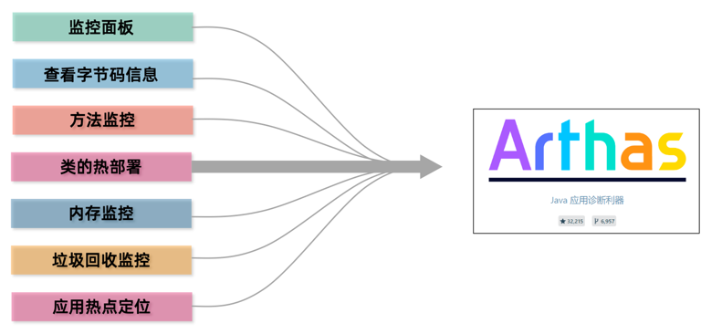

在官网下载压缩包后, 解压执行 `java -jar arthas-boot.jar` 命令启动即可;

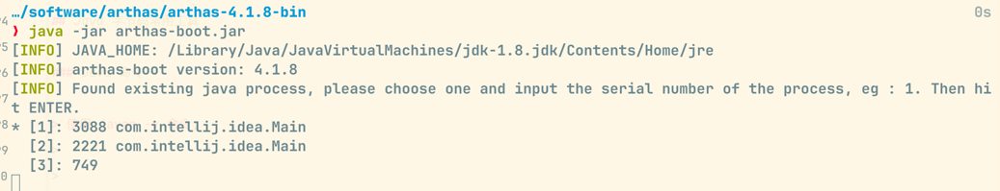

输入想查看的进程编号,点击回车即可查看相关运行程序信息,如下所示:

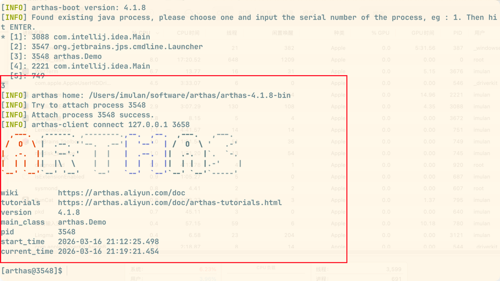

#### 查看实时数据面板

指定观察的线程后,再执行命令: `dashboard -i 2000 -n 1`

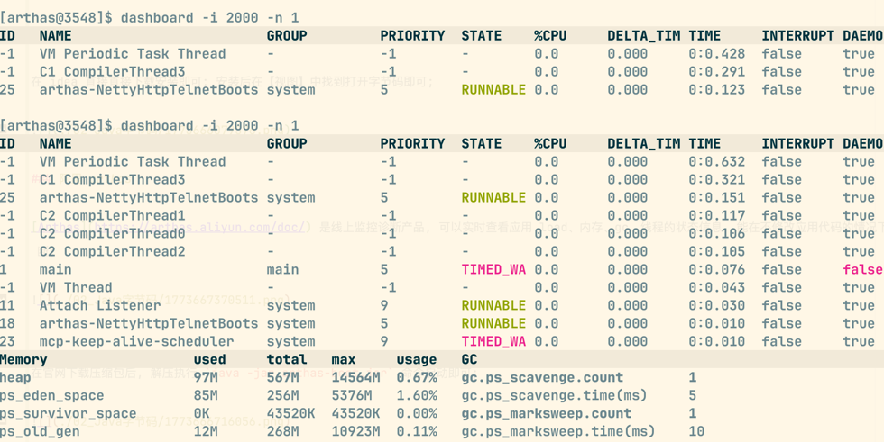

#### 移动字节码文件到指定目录

执行命令: `dump -d workspace/test 类的全限定名`

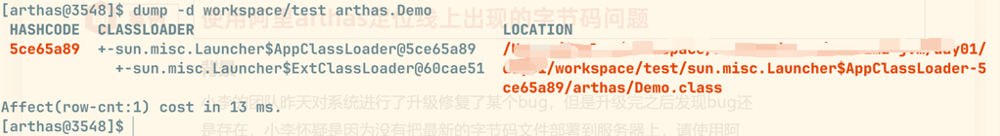

#### 反编译成类的源代码

执行命令: `jad 类的全限定名`

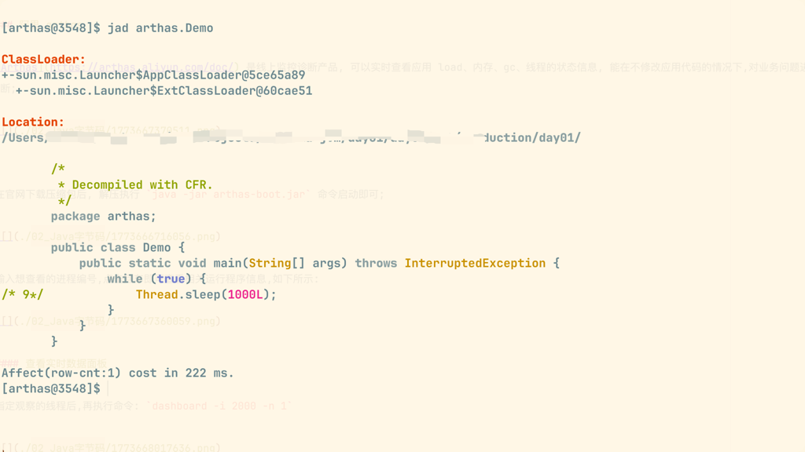

## 问题自测

1、如何查看字节码文件?

可以使用 javap 命令、jclasslib 工具、阿里云的 arthas 工具;

2、字节码文件的核心组成有哪些?

**基础信息**、**常量池**、字段、接口、**方法**、属性

