# 类的生命周期

> 类的生命周期描述了一个类加载、使用、卸载的整个过程；主要分为：加载、连接、初始化、使用、卸载五个阶段；
> 
> 连接可以分为三个小阶段：验证、准备、解析

## 加载（Loading）

加载的第一步是**类加载器**根据类的全限定名通过不同的渠道（本地文件、程序动态代理生成、早期网络传输的类）以二进制流的方式获取字节码信息；

类加载器在加载完类之后，**Java 虚拟机**将字节码中的信息保存到**方法区**中；

> 方法区是 Java 虚拟机规范的一个概念，并不是真实存在；不同的虚拟机在设计方法区时，会用到不同的内存空间，如永久代、元空间；

并**生成一个 `instanceKlass` 对象，保存类的所有信息**，还包含实现特定功能比如多态的信息；

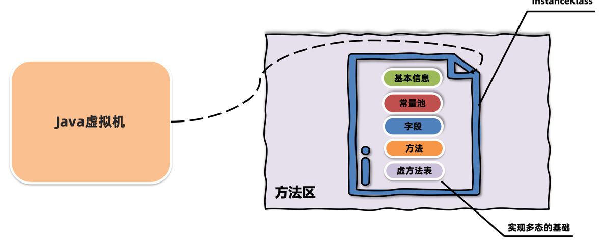

同时，Java 虚拟机会在堆中生成一份与方法区中数据类似的`java.lang.Class`对象；**用于在 Java 代码中去获取类的信息；**

> JDK8 以前静态字段数据存放在方法区中，之后存放在堆区；`instanceklass` 和 `Class` 对象相互关联，可以相互找到对方；

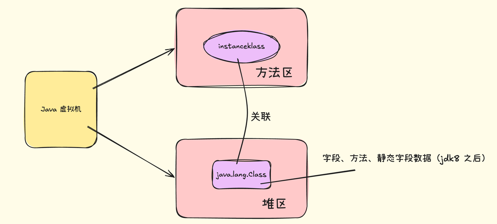

> 为什么需要两份类似的数据结构来占用空间存储？
> 
> `instanceklass` 对象是 C++ 语言编写的对象，Java 一般不能直接访问并操作；因此 Java 虚拟机在堆区中创建了一个用 Java 包装之后的`Class`对象；
> 
> 这样，**只需要访问堆中的 `Class` 对象而不需要访问方法区中的所有信息，Java 虚拟机能够很好控制开发者访问数据的范围；**

此外，`Class` 对象占用的空间会比 `instanceklass` 对象更小，因为 `Class` 只包含了如方法、字段等必要的信息；

### 查看内存中的对象

可以使用 JDK 自带的 hsdb 工具查看 Java 虚拟机内存信息，位于 JDK 安装目录下 lib 文件夹中的 sa-jdi.jar 工具包；

启动命令如下：

```shell
java -cp sa-jdi.jar sun.jvm.hotspot.HSDB

# jdk17执行
jhsdb hsdb

```

看到窗口后，输入 Java 进程 id 集合查看相关内存信息；(mac 可能需要授权)

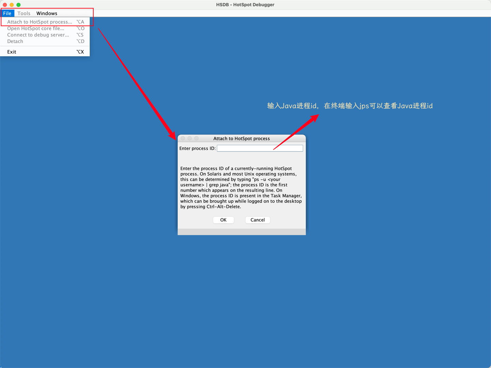

使用了 sudo 授权依旧出现了连接错误，可能需要关闭 Mac 的 SIP ，暂时跳过

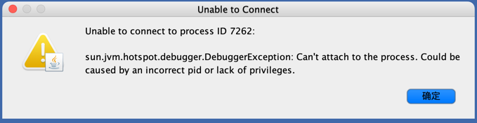

---

## 连接（Lingking）

### 验证

> 验证字节码内容是否符合 Java 虚拟机规范；

主要包含四部分：

1. 文件格式验证，比如文件是否以`OxCAFEBABE`开头，主次版本号是否满足当前 Java 虚拟机版本要求；


若修改文件头的字节，则 Java 没有办法再识别 Class 文件；

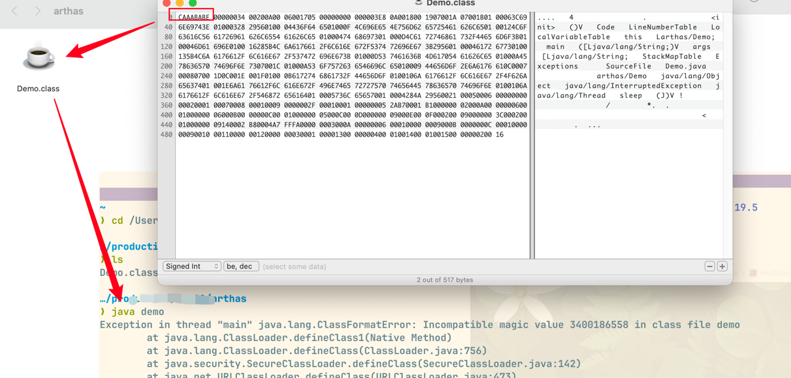

2. 元信息验证，例如类必须要有父类（super 不能为空）；

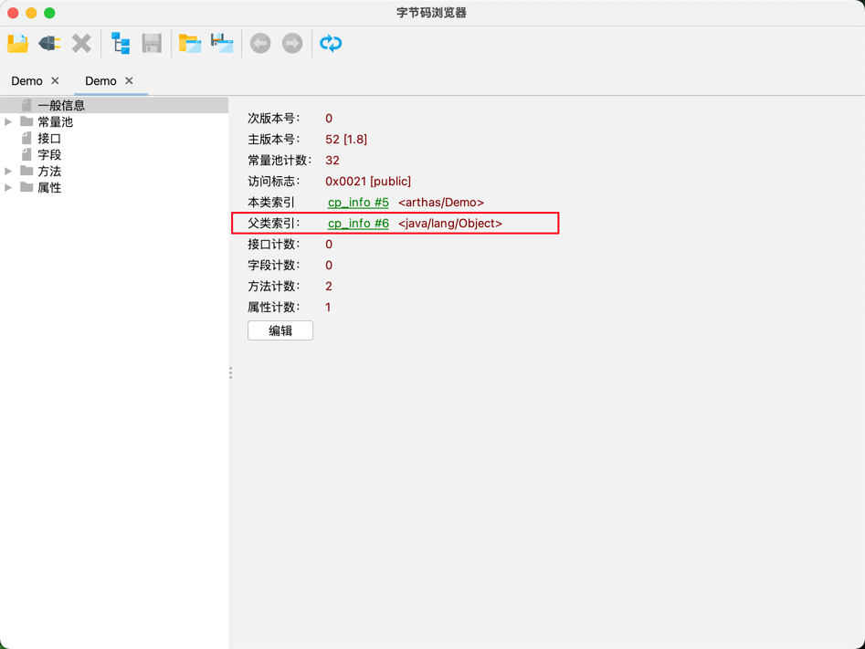

3. 验证程序执行指令的语义是否正确；
4. 符号引用验证，例如是否访问了其他类中`private`方法等；
### 准备

> 给静态变量分配内存并设置初值（默认值）；

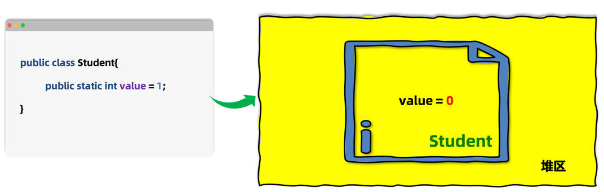

准备阶段只会给静态变量赋初值，基本数据类型和引用数据类型都有初始值；

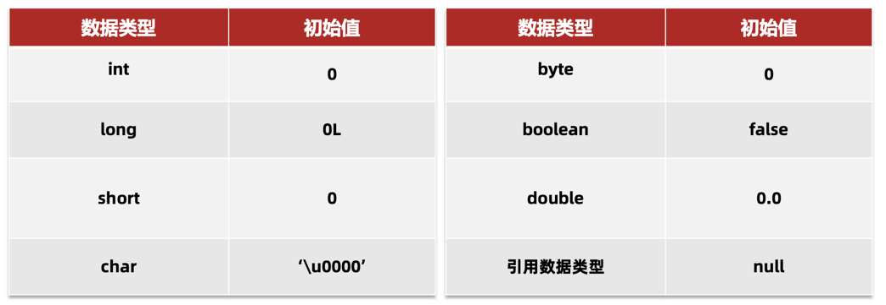

为了避免静态变量指向的内存区域之前有残留的随机值，因此需要设置初始值；

如果静态变量是 final 修饰的常量，则会再准备阶段直接将代码中的值进行赋值：

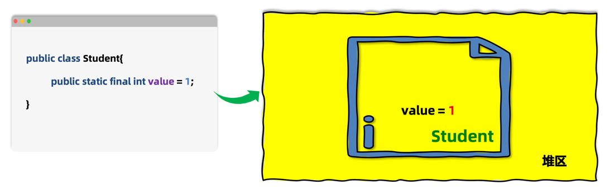


### 解析

> 将常量池中的符号引用替换成指向内存的直接引用；

- 符号引用：**在字节码文件中使用编号来访问常量池中的内容**；
- 直接引用：不再使用编号，**使用内存中的地址直接访问具体的数据**；
---

## 初始化阶段

> 初始化阶段会**执行静态代码块中的代码**，并**为静态变量赋值**；

会执行字节码文件中 **clinit（class init）** 部分的字节码指令；

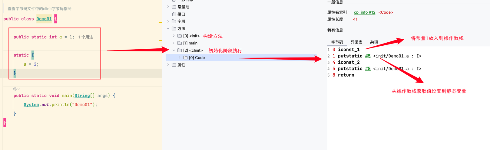

颠倒静态代码块和静态变量初始化的代码顺序后，字节码指令也会随之颠倒；

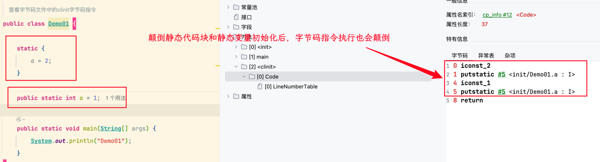

即，**clinit 方法中的执行顺序与 Java 中代码编写的顺序是一致的；**

> Java 启动时添加 `-XX:+TraceClassLoading` 参数可以打印出加载并初始化的类

**导致类的初始化方式**：
1. 访问一个类静态变量或者静态方法时；*（变量是 final 修饰的且等号右边是常量则不会触发初始化）*
2. 手动调用`Class.forName(String className)`方法时；
3. `new`一个类的对象时；
4. 当前类的`Main`执行；

题目示例 1：

```java
public class Test1 {  
    public static void main(String[] args) {  
        System.out.println("A");  
        new Test1();  
        new Test1();  
    }  
  
    public Test1(){  
        System.out.println("B");  
    }  
  
    {        System.out.println("C");  
    }  
  
    static {  
        System.out.println("D");  
    }  
}
```

解答：

> 执行结果输出”DACBCB“；
> 
> 启动 `main` 方法后先执行静态代码块输出”D“，接着 `main` 方法往下执行输出”A“，`new`创建对象时，会先执行代码块再执行构造函数，因此输出”CB“，所以最终结果为”DACBCB“；

**clinit 指令在以下情况不会出现**：

1. 没有静态代码块，也没有静态变量赋值语句；
2. 有静态变量声明，但是没有赋值语句；
3. 静态变量使用 `final` 关键字修饰，会再准备阶段直接初始化；

**父类和子类初始化阶段：**

1. 访问父类的静态变量时，不会触发子类的初始化；
2. 子类的初始化 clinit 调用之前，会先调用父类的 clinit 初始化方法；

题目示例 2：

```java
public class Demo02 {  
    public static void main(String[] args) {  
        new B02();  
        System.out.println(B02.a);  
    }  
}  
  
class A02 {  
    static int a = 0;  
  
    static {  
        a = 1;  
    }  
}  
  
class B02 extends A02 {  
    static {  
        a = 2;  
    }  
}
```

解答：

> 输出：2；
> 
> 在初始化创建 `BO2` 时，会优先初始化父类 `A02`，因此 `a` 先后被赋值为 1 和 2，最后 `a` 的值是 2


### 练习题

题 1：分析下述代码运行结果？

```java
public class Test2 {  
    public static void main(String[] args) {  
        Test2_A[] arr = new Test2_A[10];  
    }  
}  
  
class Test2_A {  
    static {  
        System.out.println("Test2_A的静态代码块运行");  
    }  
}
```

解答：
> 应该是没有输出，因为**数组的创建不会导致元素中的类进行初始化；**


题 2：分析如下代码运行结果？

```java
public class Test4 {  
    public static void main(String[] args) {  
        System.out.println(Test4_A.a);  
    }  
}  
  
class Test4_A {  
    public static final int a = Integer.valueOf(1);  
  
    static {  
        System.out.println("Test3_A的静态代码块运行");  
    }  
}
```

解答：

> 输出结果如下：
> 
> Test3_A的静态代码块运行
> 
> 1
> 
> `final` 修饰的静态变量若赋值是常量，则不会触发初始化，但是**赋值的值需要执行指令才能得出结果时，会执行 clinit 方法进行初始化**；


   
   
   
