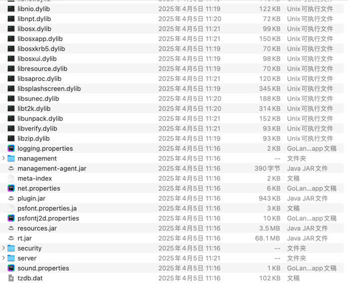
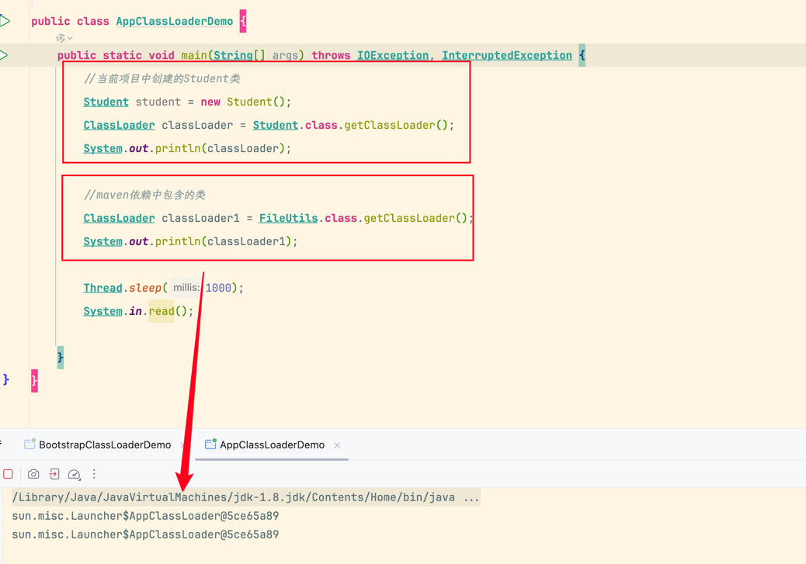
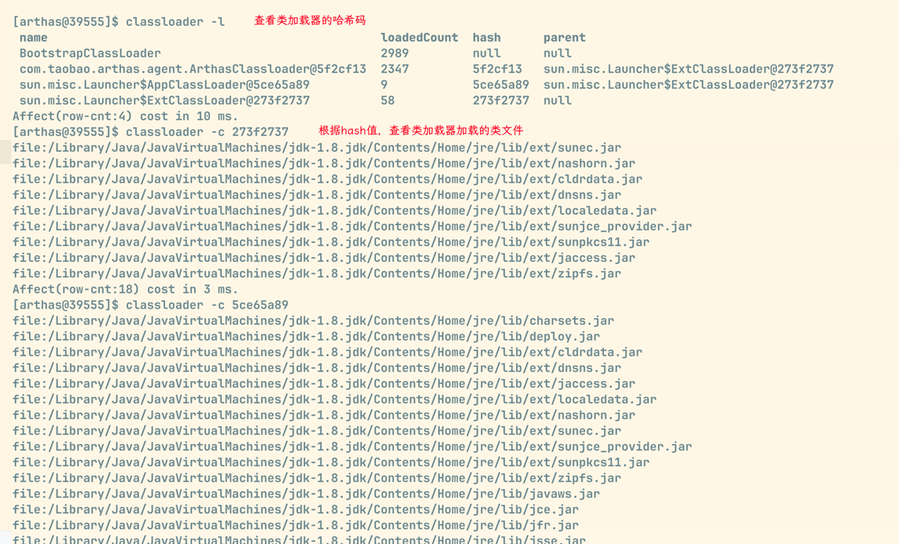

# 类加载器

类加载器（ClassLoader）是 Java 虚拟机提供给应用程序去实现获取类和接口字节码数据的技术；类加载器只参与加载过程中字节码获取并加载到内存这一部分；

> 类加载过程中，生成方法区对象，生成堆上 Class 对象是调用本地接口 JNI（Java Native interface） 在 Java 虚拟机中处理的；

应用场景：

- SPI 机制；
- 类的热部署；
- Tomcat 类的隔离；
- Arthas 不停机解决线上故障；

## 分类

类加载器分为两类，一类是 Java 虚拟机底层源码实现的；一类是 Java 代码中实现的；

**Java 虚拟机底层实现类加载器**：

1. 源代码位于 Java 虚拟机源码中，实现语言与虚拟机底层语言一致，比如 Hotspot 使用 C++；
2. 主要用于加载程序运行时的基础类，保证 Java 程序运行中基础类被正确的加载，比如`java.lang.String`，确保其可靠性；

**Java 代码中实现的类加载器**：

1. JDK 中默认提供了多种处理不同渠道的类加载器，程序员可以根据需求定制；
2. 所有 Java 中实现的类加载器都需要继承`ClassLoader`这个抽象类；

类加载器的设计 JDK8 和 8 之后的版本差别较大，**JDK8 及之前的版本中默认的类加载器有以下几种**：

使用 Arthas 中的 `classloader` 命令可以查看类加载器的详细信息：

### 启动类加载器

> 启动类加载器（Bootstrap ClassLoader）是由 Hotspot 虚拟机提供的，使用 C++ 编写的类加载器；

启动类加载器默认加载 Java 安装目录`jre/lib`下的类文件，比如 rt.jar、tools.jar、resource.jar 等；

可以使用 Arthas 的 [sc](https://arthas.aliyun.com/doc/sc.html) 命令来搜索一个类，并打印出这个类的类加载器：

> 由于启动类加载器过于底层，出于安全考虑，不应该在 Java 层面上可以获取到该加载器

如何加载自定义 jar 包：

1. 将 jar 包放入`jre/lib`目录进行扩展；（不推荐，原则上尽可能不去更改 JDK 安装目录中的内容，同时由于 Java 虚拟机规范由于文件名等问题也可能不会正常加载）；
2. 使用 jvm 参数`-Xbootclasspath:a:jar包目录/jar包名`进行扩展；

### Java 中的默认类加载器

> 扩展类加载器和应用程序类加载器都是 JDK 中提供的，使用 Java 编写的类加载器；

扩展类加载器和应用程序类加载器的**源代码都位于`sum.misc.Launcher`中，是一个静态内部类；继承自`URLClassLoader`；可以通过目录或则指定 jar 包将字节码文件加载到内存中；**

#### 扩展类加载器

> 扩展类加载器（Extension ClassLoader）是 JDK 提供的，Java 编写的类加载器；

扩展类加载器默认加载 Java 安装目录`jre/lib/ext`下的类文件；

推荐使用 JVM 参数`-Djava.ext.dirs=jar包目录` 来加载自定义 jar 包进行扩展；但是这种方式会覆盖掉原始目录，可以用`原始目录:自定义jar包目录`（mac/linux，windows 用分号）来追加目录的形式去加载；

> 目录中有特殊字符，用双引号括起来；

#### 应用类加载器

主要加载 classpath 下的类文件；包括第三方 jar 包中的类文件；

可以使用 Arthas 的`classloader -c hash`命令查看类加载器的加载路径和加载的文件：

