# 类加载器

类加载器（ClassLoader）是 Java 虚拟机提供给应用程序去实现获取类和接口字节码数据的技术；类加载器只参与加载过程中**字节码获取并加载到内存**这一部分；

> 类加载过程中，生成方法区对象，生成堆上 Class 对象是调用本地接口 JNI（Java Native interface） 在 Java 虚拟机中处理的；

应用场景：

- SPI 机制；
- 类的热部署；
- Tomcat 类的隔离；
- Arthas 不停机解决线上故障；

## 分类

类加载器分为两类，一类是 Java 虚拟机底层源码实现的；一类是 Java 代码中实现的；

**Java 虚拟机底层实现类加载器**：

1. 源代码位于 Java 虚拟机源码中，实现语言与虚拟机底层语言一致，比如 Hotspot 使用 C++；
2. 主要用于加载程序运行时的基础类，保证 Java 程序运行中基础类被正确的加载，比如`java.lang.String`，确保其可靠性；

**Java 代码中实现的类加载器**：

1. JDK 中默认提供了多种处理不同渠道的类加载器，程序员可以根据需求定制；
2. 所有 Java 中实现的类加载器都需要继承`ClassLoader`这个抽象类；


类加载器的设计 JDK8 和 8 之后的版本差别较大，**JDK8 及之前的版本中默认的类加载器有以下几种**：

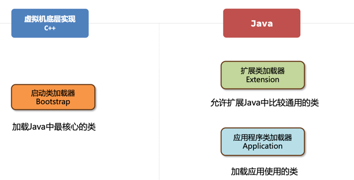

使用 Arthas 中的 `classloader` 命令可以查看类加载器的详细信息：

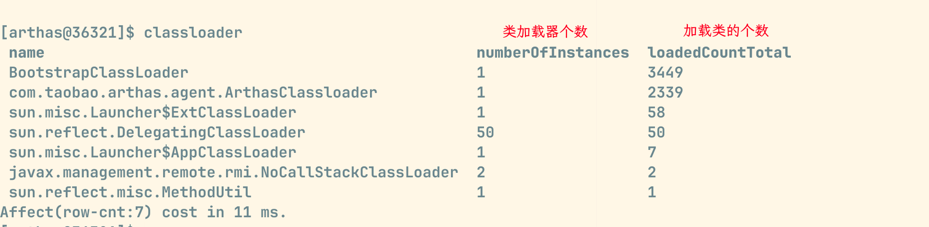

### 启动类加载器

> 启动类加载器（Bootstrap ClassLoader）是由 Hotspot 虚拟机提供的，使用 C++ 编写的类加载器；

启动类加载器默认加载 Java 安装目录`jre/lib`下的类文件，比如 rt.jar、tools.jar、resource.jar 等；


可以使用 Arthas 的 [sc](https://arthas.aliyun.com/doc/sc.html) 命令来搜索一个类，并打印出这个类的类加载器：

> 由于启动类加载器过于底层，出于安全考虑，不应该在 Java 层面上可以获取到该加载器

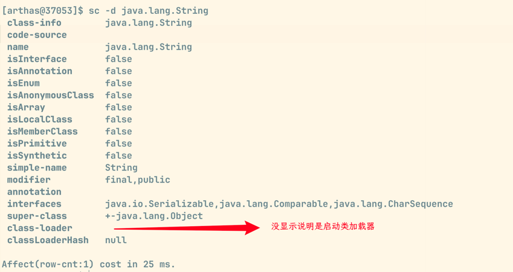

如何加载自定义 jar 包：

1. 将 jar 包放入`jre/lib`目录进行扩展；（不推荐，原则上尽可能不去更改 JDK 安装目录中的内容，同时由于 Java 虚拟机规范由于文件名等问题也可能不会正常加载）；
2. 使用 jvm 参数`-Xbootclasspath:a:jar包目录/jar包名`进行扩展；


### Java 中的默认类加载器

> 扩展类加载器和应用程序类加载器都是 JDK 中提供的，使用 Java 编写的类加载器；

扩展类加载器和应用程序类加载器的**源代码都位于`sum.misc.Launcher`中，是一个静态内部类；继承自`URLClassLoader`；可以通过目录或则指定 jar 包将字节码文件加载到内存中；**

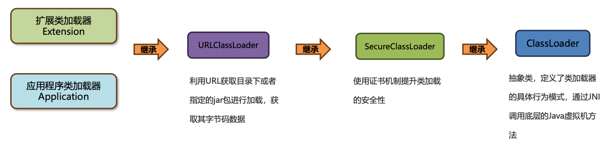

#### 扩展类加载器

> 扩展类加载器（Extension ClassLoader）是 JDK 提供的，Java 编写的类加载器；

扩展类加载器默认加载 Java 安装目录`jre/lib/ext`下的类文件；

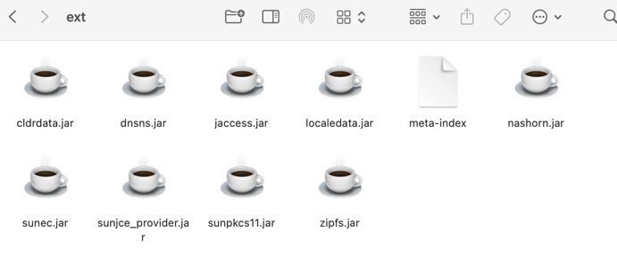

推荐使用 JVM 参数`-Djava.ext.dirs=jar包目录` 来加载自定义 jar 包进行扩展；但是这种方式会覆盖掉原始目录，可以用`原始目录:自定义jar包目录`（mac/linux，windows 用分号）来追加目录的形式去加载；

> 目录中有特殊字符，用双引号括起来；

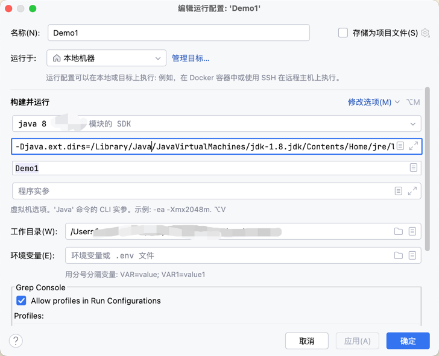

#### 应用类加载器

主要加载 classpath 下的类文件；包括第三方 jar 包中的类文件；


可以使用 Arthas 的`classloader -c hash`命令查看类加载器的加载路径和加载的文件：


## 双亲委派机制

> 由于 Java 虚拟机中有多个类加载器，双亲委派机制的核心是解决一个类到底由谁加载的问题；


### 作用

1. 保证类加载的安全性：通过双亲委派机制避免恶意代码替换 JDK 中的核心类库，确保核心类库的完整性和安全性；
2. 避免重复加载：双亲委派机制可以避免同一个类被多次加载；


### 是什么

双亲委派机制指的是：当一个类加载器接收到加载类的任务时，会**自底向上查找是否加载过，再由顶向下进行加载；**

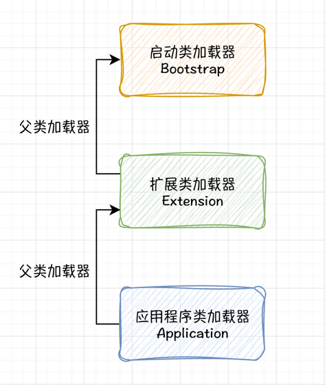

向上查找如果已经加载过，就直接返回 Class 对象，加载过程结束，可以避免一个类重复加载；

如果所有父类加载器都无法加载该类，则由当前类加载器自己尝试加载，所以看上去是自顶向下尝试加载；

> 每个 Java 实现的类加载器保存了一个成员变量叫“父类加载器”，可以理解为上级；即**类加载器与父类加载器不是继承关系；**

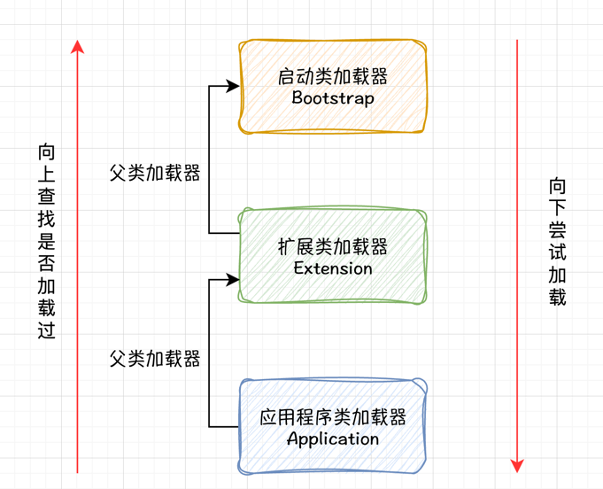

> 常见问题：
> 
> 1、如果一个类重复出现在三个类加载器的加载位置，由谁来加载？
> 
> 由启动类加载器加载，根据双亲委派机制，它的优先级是最高的；
> 
> 2、在自己项目中创建`java.lang.String`类，会被加载吗？
> 
> 不能，会返回启动类加载器加载在`rt.jar`包中的 `String` 类
> 
> 3、类加载器的关系
> 
> 应用类加载器的父类加载器是扩展类加载器，扩展类加载器的父类加载器虽然是 null，其实就是启动类加载器；


如何在 Java 代码中去主动加载一个类：
1. 使用`Class.forName`方法，会使用当前类的类加载器去加载指定的类；
2. 获取到当前类的类加载器，通过类加载器的`loadClass`方法加载指定类；


可以在 Arthas 中使用命令`classloader -t`查看类加载器的继承关系；

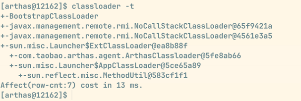


## 打破双亲委派


### 自定义类加载器

> 自定义类加载器并重写`loadClass`方法，就可以将双亲委派机制的代码去除；Tomcat 通过这种方式实现应用之间的类隔离；

一个 Tomcat 程序可以允许多个 Web 应用，如果两个应用出现相同限定名的类，比如 Servlet 类；要保证这两个类都能加载并且它们应该是不同的类，如果不打破双亲委派机制，当应用类加载器加载Web应用1中的`MyServlet`之后，Web应用2中相同限定名的`MyServlet`类就无法被加载了;

Tomcat 使用了自定义类加载器来实现应用之间类的隔离，每一个应用都会有一个独立的类加载器加载对应的类；

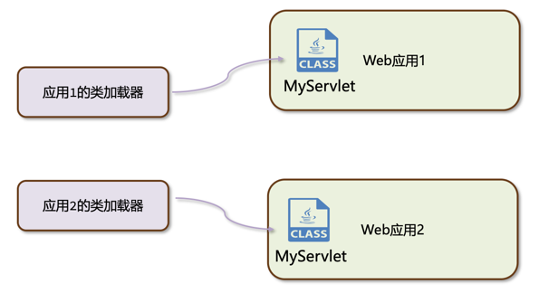


ClassLoader 主要包含有以下 4 个核心方法：

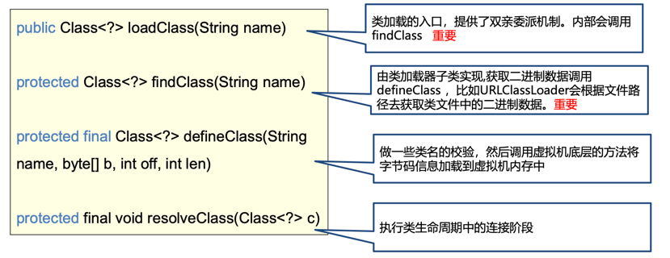

loadClass 方法核心代码如下，需要打破双亲委派机制，则重写委派给父类加载器的逻辑代码即可；

```java
protected Class<?> loadClass(String name, boolean resolve)  
    throws ClassNotFoundException  
{  
    synchronized (getClassLoadingLock(name)) {  
        // 首先，检查这个类是不是被加载过，被加载过则直接返回
        Class<?> c = findLoadedClass(name);  
        if (c == null) {  
            long t0 = System.nanoTime();  
            try {  
	            // 父类加载器是不是为空
                if (parent != null) {
	                // 父类加载器不为空则由父类加载器继续加载，向上委派  
                    c = parent.loadClass(name, false);  
                } else {  
	                // 父类加载器为空则由启动类加载器加载
                    c = findBootstrapClassOrNull(name);  
                }  
            } catch (ClassNotFoundException e) {  
                // 父类加载器加载失败，继续往下走，即由当前类加载器开始加载         
            }  
  
            if (c == null) {  
                // 加载的类还是为空，说明父类加载器加载不成功，则由当前类加载器继续加载            
                long t1 = System.nanoTime();  
                // 由继承 ClassLoader 类的子类实现
                c = findClass(name);  
  
                // 记录一些类加载器统计信息
sun.misc.PerfCounter.getParentDelegationTime().addTime(t1 - t0);  
                sun.misc.PerfCounter.getFindClassTime().addElapsedTimeFrom(t1);  
                sun.misc.PerfCounter.getFindClasses().increment();  
            }  
        }  
        if (resolve) {  
            resolveClass(c);  
        }  
        return c;  
    }  
}
```

自定义类加载器如下所示：

```java
public class BreakClassLoader1 extends ClassLoader {  
  
    private String basePath;  
    private final static String FILE_EXT = ".class";  
  
    public void setBasePath(String basePath) {  
        this.basePath = basePath;  
    }  
  
    private byte[] loadClassData(String name)  {  
        try {  
            String tempName = name.replaceAll("\\.", Matcher.quoteReplacement(File.separator));  
            FileInputStream fis = new FileInputStream(basePath + tempName + FILE_EXT);  
            try {  
                return IOUtils.toByteArray(fis);  
            } finally {  
                IOUtils.closeQuietly(fis);  
            }  
  
        } catch (Exception e) {  
            System.out.println("自定义类加载器加载失败，错误原因：" + e.getMessage());  
            return null;  
        }  
    }  
  
    @Override  
    public Class<?> loadClass(String name) throws ClassNotFoundException {  
        if(name.startsWith("java.")){  
            // Object 类的加载  
            return super.loadClass(name);  
        }  
        byte[] data = loadClassData(name);  
        return defineClass(name, data, 0, data.length);  
    }  
  
    public static void main(String[] args) throws ClassNotFoundException, InstantiationException, IllegalAccessException, IOException {  
        BreakClassLoader1 classLoader1 = new BreakClassLoader1();  
  
        // 获取自定义父类加载器  
        System.out.println(classLoader1.getParent());   
     }  
}
```

自定义加载器的父类加载器，如果不指定，则默认是应用程序类加载器；ClassLoader 的构造器如下所示：

```java
protected ClassLoader() {  
	// getSystemClassLoader() 方法默认返回的是应用程序类加载器 AppClassLoader
    this(checkCreateClassLoader(), getSystemClassLoader());  
}

private ClassLoader(Void unused, ClassLoader parent) {  
    this.parent = parent;  
    if (ParallelLoaders.isRegistered(this.getClass())) {  
        parallelLockMap = new ConcurrentHashMap<>();  
        package2certs = new ConcurrentHashMap<>();  
        assertionLock = new Object();  
    } else {  
        // no finer-grained lock; lock on the classloader instance  
        parallelLockMap = null;  
        package2certs = new Hashtable<>();  
        assertionLock = this;  
    }  
}
```

在同一个 Java 虚拟机中，只有**相同类加载器+相同的类限定名**才会被认为是同一个类；因此有两个不同的自定义类加载器加载相同限定名的类，不会冲突；

使用 Arthas 的命令`sc -d 类全限定名`可以查看类的详细信息，可以发现一个类被加载了两次，但是因为不是同一个类加载器实例加载的，因此没有产生冲突；

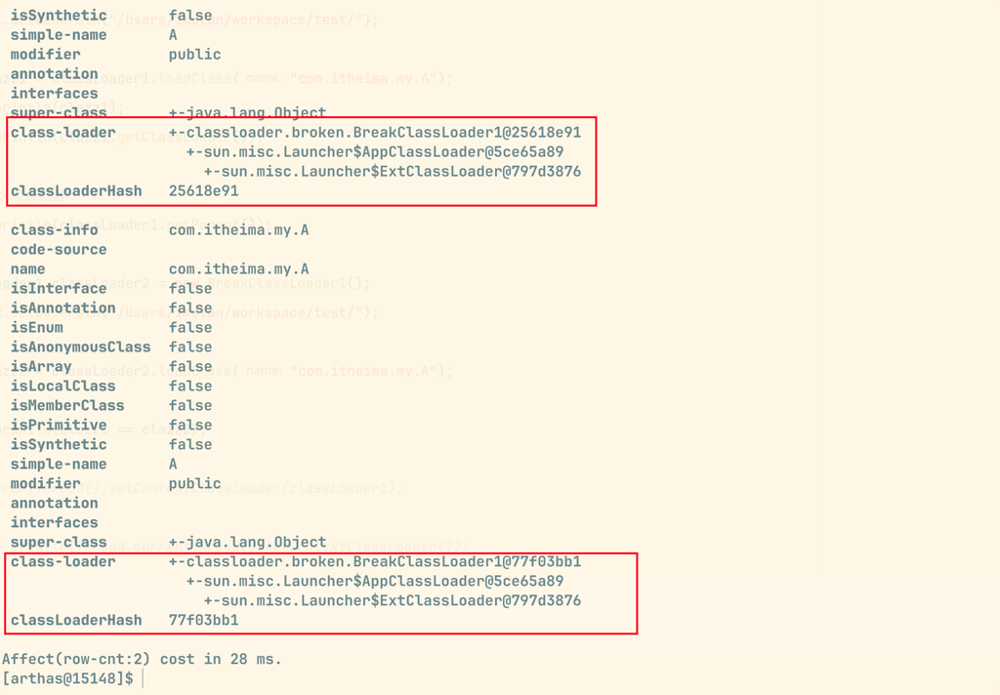

> [!TIP] 
> 正确去实现一个自定义类加载器的方式是重写`findClass`（即自定义类的加载的方式，比如从数据库中加载二进制文件）方法，而不是破坏双亲委派机制；


### 线程上下文类加载器

> 利用上下文类加载器加载类，如 JDBC 和 JNDI 等；

JDBC 中使用了 DriverManager 来管理项目中引入的不同数据库的驱动，比如 MySQL 驱动、Oracle 驱动；

- DriverManger 是由 Java 提供的，位于`rt.jar`包中，由启动类加载器加载；
- 依赖的 MySQL 驱动对应的类，是由应用程序类加载器加载；

即启动类加载器需要委托应用程序类加载器加载 jar 包中的数据库驱动，违反了双亲委派机制：

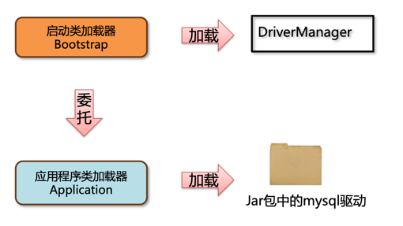

DriverManager 使用 SPI 机制，最终加载 jar 包中对应的驱动类：

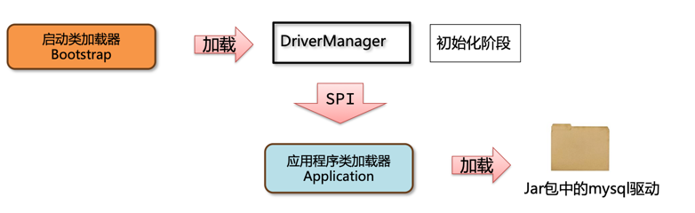

---
#### SPI 机制

> SPI（Service Provider interface）是 JDK 内置的一种服务提供发现机制；

MySQL 驱动源码如下所示：

```java
package com.mysql.cj.jdbc;

public class Driver extends NonRegisteringDriver implements java.sql.Driver {  
    public Driver() throws SQLException {  
    }  
  
    static {  
        try {  
	        // 注册 MySQL 驱动，委托给应用程序类加载器加载；
            DriverManager.registerDriver(new Driver());  
        } catch (SQLException var1) {  
            throw new RuntimeException("Can't register driver!");  
        }  
    }  
}

```

**SPI 工作原理：**

1、在 ClassPath 路径下的`META-INF/services`文件夹中，以接口的全限定名来命名文件，对应文件内容则是接口实现类的全限定路径：

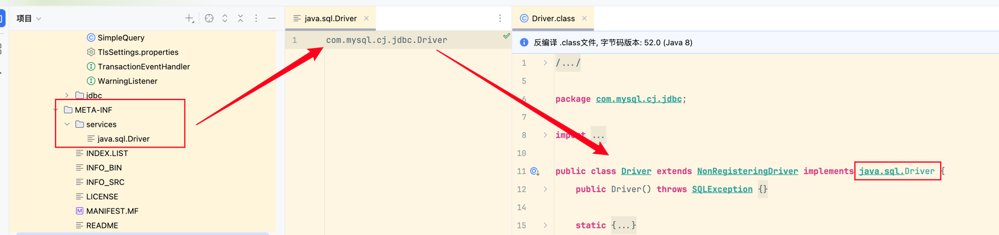

2、使用 `ServiceLoader` 加载接口类，会得到一个迭代器，用于迭代接口的实现类，接着使用类加载器加载对应接口的实现类；

DriverManager 的关键代码如下：

```java

public class DriverManager {

    static {
        // 静态初始化,加载驱动
        loadInitialDrivers();
        println("JDBC DriverManager initialized");
    }
    
    private static void loadInitialDrivers() {  
    // do something ...
    
    AccessController.doPrivileged(new PrivilegedAction<Void>() {  
        public Void run() {  
  
			// 加载 java.lang.Driver.Class 接口的实现类
            ServiceLoader<Driver> loadedDrivers = ServiceLoader.load(Driver.class);  
            // 得到接口实现类的迭代器
            Iterator<Driver> driversIterator = loadedDrivers.iterator();  
  
            try{  
	            // 迭代遍历驱动实现类
                while(driversIterator.hasNext()) {  
                    driversIterator.next();  
                }  
            } catch(Throwable t) {  
            // Do nothing  
            }  
            return null;  
        }  
    });  
	// do something ...
}
    
}
```

即 DriverManage 被启动类加载器（Bootstrap）加载，在初始化阶段通过 SPI 机制得到驱动接口的实现类并委托给应用程序类加载器（Application）加载驱动接口实现类；

**SPI 中使用了线程上下文中保存的类加载器进行类的加载**，这个类加载器一般是应用程序类加载器，ServiceLoader 的 load 方法如下所示：

```java

public static <S> ServiceLoader<S> load(Class<S> service) {  
    ClassLoader cl = Thread.currentThread().getContextClassLoader();  
    return ServiceLoader.load(service, cl);  
}

```


可以允许如下代码测试线程上下文类加载器的结果：

```java
public class NewThreadDemo {  
    public static void main(String[] args) {  
	    // 打印结果为应用程序类加载器
        new Thread(() -> System.out.println(Thread.currentThread().getContextClassLoader())).start();  
    }  
}
```


> [!TIP]
> JDBC 真的打破双亲委派机制吗？
> 
> 第一个说法：
> 
> 由启动类加载器加载的类，委派应用程序类加载器去加载类的方式，确实打破了双亲委派机制；
> 
> 第二个说法：
> 
> 双亲委派机制描述的是一个类的加载过程，DriverManager 是由启动类加载器加载的，驱动类是由应用程序类加载器正常加载的，**JDBC 只是在 DriverManager 加载完之后，通过初始化阶段触发了驱动类的加载，类本身的加载依然遵循双亲委派机制；**
> 


### OSGI 框架的类加载器

> OSGI 框架实现了一套新的类加载器机制，允许同级之间委托进行类的加载；并通过类加载器实现了**热部署（在服务不停止的情况下，动态地更新字节码文件到内存中）** 的功能；

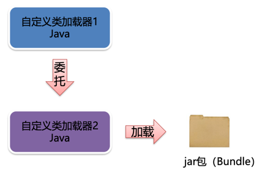

## JDK9 之后的类加载器

> JDK8 及之前的版本中，扩展类加载器和应用程序类加载器的源码都位于`rt.jar`包的`sum.misc.Launcher.java`类中；

在 JDK9 引入了 module 的概念，类加载器在设计上有很多变化：

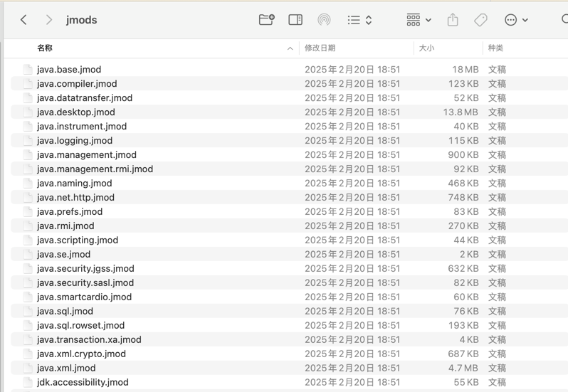


1. 启动类加载器使用 Java 编写，位于`jdk.internal.loader.ClassLoaders`类中；Java 中的`BootClassLoader`继承自`BuiltinClassLoader`实现从模块中找到要加载的字节码资源文件；**启动类加载器依然无法通过 Java 代码获取到，返回仍然是 null**，这点保持统一；
2. 扩展类加载器被替换成了平台类加载器（Platform Class Loader）；平台类加载器遵循模块化方式加载字节码文件，所以从继承`URLClassLoader`变成`BuiltinClassLoader`实现从模块中加载字节码文件；**平台类加载器的存在更多是为了与老版本的设计方案兼容，自身没有特殊逻辑；**
3. 应用程序类加载器从继承`URLClassLoader`变成`BuiltinClassLoader`实现从模块中加载字节码文件；


## 问题

1、类加载器的作用是什么？

:::details 回答

类加载器（ClassLoader）负责在类加载过程中的字节码获取并加载到内存这一部分；通过加载字节码数据放入内存转化成二进制数据（`byte[]`），接着调用虚拟机底层方法将二进制数据转换成方法区和堆中的数据；

:::

2、有几种常见的类加载器？

:::details 回答

启动类加载器（Bootstrap ClassLoader）加载核心类；
扩展类加载器（Extension ClassLoader）加载扩展类；
应用程序加载器（Application ClassLoader）加载 `classpath` 中的类；
自定义类加载器，重写 `findClass` 方法

JDK9 之后，扩展类加载器变成了平台类加载器（Platform ClassLoader）；


:::

3、什么是双亲委派机制？

:::details 回答

每个 Java 实现的类加载器中保存了一个成员变量叫“父”类加载器；

双亲委派机制：

**自底向上查找是否加载过，再自顶向下进行加载；避免了核心类被应用程序重写并覆盖的问题，提升了安全性；**

:::

4、怎么打破双亲委派机制？

:::details 回答

1. 重写 loadClass 方法，不再实现双亲委派机制；
2. JDBC 框架使用了 SPI 机制+线程上下文类加载器；
3. OSGI 实现的一整套类加载机制，允许同级类加载器之间互相调用；

:::
