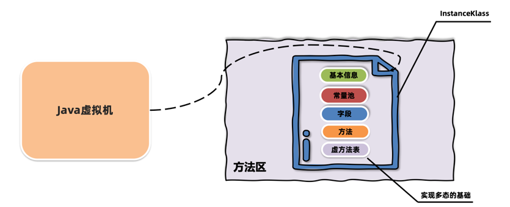
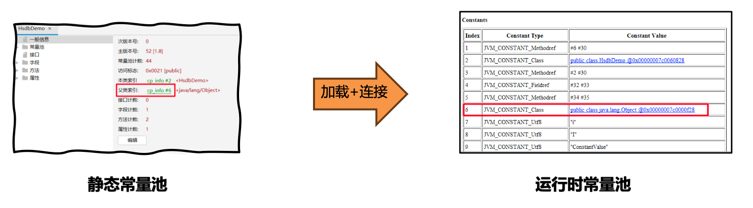
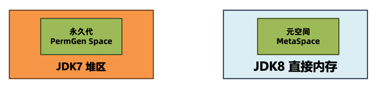
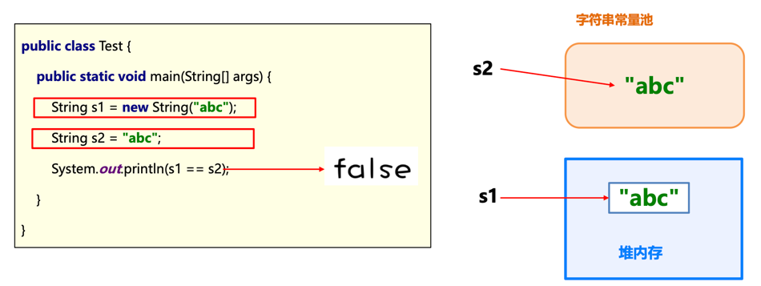
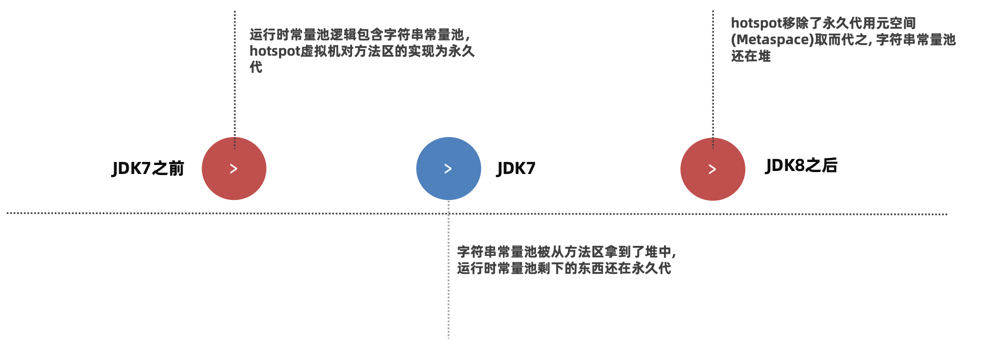
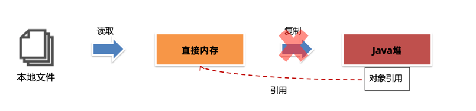
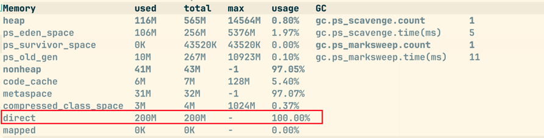
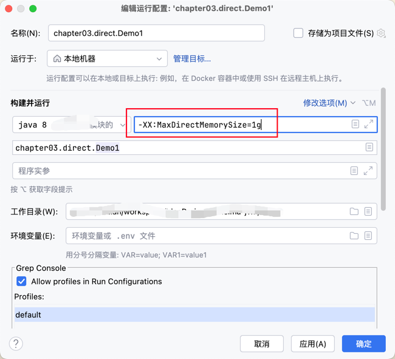

# 运行时数据区

Java 虚拟机在运行 Java 程序过程中管理的内存区域，称之为运行时数据区；

《Java 虚拟机规范》中规定了每一部分的作用；


## 程序计数器

程序计数器（Program Counter Register）也叫 PC 寄存器，每个线程通过程序计数器记录当前要执行的字节码指令的地址；


在加载阶段，**虚拟机将字节码文件中的指令读取到内存之后，会将源文件中的偏移量转换成内存地址**；每一条字节码指令都会拥有一个内存地址；


为了让解释器获取到字节码指令，在代码执行过程中，**程序计数器会记录下一行字节码指令的地址；** 执行完当前指令之后，虚拟机的执行引擎根据程序计数器来执行下一条指令；

程序计数器可以控制程序指令的进行，实现分支、跳转、异常等逻辑；

在多线程执行情况下，**Java 虚拟机需要通过程序计数器记录 CPU 切换前解析执行到哪一句指令并继续解释运行；**


> [!TIP]
> 程序计数器在允许中会出现内存溢出吗？
> 
> **内存溢出**：指的是程序在使用某一块内存区域时，存放的数据需要占用的内存大小超过了虚拟机能提供的内存上限；
> 
> 因为每个线程*只存储一个固定长度的内存地址*，**程序计数器是不会发生内存溢出的**；
> 
> 程序员无需对程序计数器做任何处理；


## 栈

Java 虚拟机栈（Java Virtual Machine Stack）采用栈的数据结构来管理方法调用中的基本数据，先进后出（First In Last Out）；每一个方法的调用使用一个栈帧（Stack Frame）来保存；


Java 虚拟机栈会随着线程的创建而创建，会在线程销毁时进行回收；由于方法可能会在不同线程中执行，因此每个线程都会包含一个自己的虚拟机栈；

栈帧是由局部变量表、操作数栈、帧数据三部分组成；


### 局部变量表

> 局部变量表的作用是在运行过程中存放所有的局部变量；

在编译成字节码文件时就可以确定局部变量表的内容；


栈帧中的局部变量表就是一个数据，数组中每一个位置称之为槽（slot）；`long` 和 `double` 类型会占用两个槽，其他类型占用一个槽；


#### 无参实例方法

而对于实例方法，在局部变量表中序号为 0 的位置存放的是 this（对象本身实例引用）；指的是当前调用方法的对象，运行时会在内存中存放实例对象的地址；


#### 有参实例方法

同时方法参数也会保存在局部变量表中，其顺序与方法中参数定义的顺序一致；即**局部变量表保存的内容由：实例方法的 this 对象，方法的参数，方法体中声明的局部变量**；


#### 局部有效变量的实例方法

为了节省空间，**局部变量表中的槽是可以复用的**，一旦某个局部变量不再生效，当前槽就可以再次被使用；


查看字节码指令也可以发现 3 号槽和 4 号槽被多次使用：


### 操作数栈

> 操作数栈是栈帧中，虚拟机在执行指令过程中用来存放临时数据的一块区域；

操作数栈是一种栈式的数据结构，如果一条指令将一个值压入操作数栈，则后面的指令可以弹出并使用该值；

在**编译期就可以确定操作数栈的最大深度**，从而在执行时正确的分配内存大小；


### 帧数据

> 帧数据主要包含动态链接、方法出口、异常表的引用；

#### 动态链接

当前类的字节码文件指令**引用了其他类的属性或者方法时**，需要将符号引用（编号）转换成对应的运行时常量池中的内存地址；

动态链接就**保存了编号到运行时常量池的内存地址的映射关系**；


#### 方法出口

方法出口指的是方法在正确或异常结束时，当前栈帧会被弹出，同时程序计数器应该指向上一个栈帧中的下一条指令的地址；所以在当前栈帧中，需要存储此方法出口的地址；


#### 异常表

异常表存放的是代码中异常的处理信息，**包含了异常捕获的生效范围以及异常发生后跳转到的字节码指令位置**；


### 栈内存溢出

Java 虚拟机栈如果栈帧过多，占用内存超过栈内存可以分配的最大大小就会出现**内存溢出**；

Java 虚拟机栈内存溢出时会出现`StackOverflowError`的错误；


如果不指定栈的大小，JVM 将创建一个具有默认大小的栈；默认大小取决于操作系统和计算机的体系结构；


创建一个递归方法自调用进行栈内存溢出模拟，最终是 18165 次后出现的溢出错误


可以使用虚拟机参数 `-Xss栈大小(单位，默认字节(k))`来修改 Java 虚拟机栈的大小；

依旧是采用栈内存溢出模拟，调整栈大小为 1024k 后，7616 次之后就出现了栈溢出：


> [!TIP]
> 除了`-Xss`参数外，也可以使用`-XX:ThreadStackSize=字节数`来调整堆栈大小；
> 
> Hotspot JVM 对栈大小的最大值和最小值有要求；Windows（64位）下的JDK8测试最小值为180k，最大值为1024m。
> 
> 此外**局部变量过多、操作数栈深度过大也会影响栈内存的大小**；一般情况下，工作中即便使用了递归进行操作，栈的深度也最多几百，不会出现栈的溢出；因此可以手动指定大小为 256k 来节省内存；

### 本地方法栈

Java 虚拟机栈存储了 Java 方法调用时的栈帧，而本地方法栈存储的是 native 本地方法的栈帧；

在 Hotspot 虚拟机中，**Java 虚拟机栈和本地方法栈实现上使用了同一个栈空间**；本地方法栈会在栈内存上生成一个栈帧，临时保存方法的参数同时方便出现异常时也把本地方法的栈信息打印出来；


## 堆

一般 Java 程序中堆内存是空间最大的一块内存区域，创建出的对象都存在于堆上；

栈上的局部变量表中，可以存放堆上对象的引用；静态变量也可以存放堆对象的引用，通过静态变量就可以实现对象在线程之间共享；


同时堆内存也是会内存溢出的，堆内存是有上限的，一直往堆中放入对象达到上限之后，就会抛出`OutofMemory`错误；


堆空间有三个重要的值：
- used：当前已使用的堆内存
- total：是 Java 虚拟机已经分配的可用堆内存；
- max：是 Java 虚拟机可以分配的最大堆内存；

使用 Arthas 的 `dashboard -i 刷新频率（毫秒）` 命令可以看到堆内存 used、total、max 三个值；


随着堆中的对象增多，当 total 可以使用的内存感觉到不足时，Java 虚拟机会继续分配内存给堆；

> [!TIP]
> 并不是当 used=max=total 的时候就堆内存溢出了；


如果不设置任务的虚拟机参数，max 默认是系统内存的 1/4，total 默认是系统内存的 1/64；在实际应用中一般都需要设置 total 和 max 的值；

要修改堆的大小，可以使用虚拟机参数`-Xmx值(默认字节 k)`（max 最大值）和`-Xms(默认字节 k)`（初始的 total）；

> 限制：Xmx必须大于 2 MB，Xms必须大于1MB


> Arthas 的 heap 堆内存使用了 JMX 技术中内存获取方式，这种方式与垃圾回收器有关，**计算的是可以分配对象的内存**，而不是整个内存；

Java 服务端程序开发时，建议**将`-Xmx`和`-Xms`设置为相同的值**，这样程序启动之后可使用的总内存就是最大内存，不需要再向 Java 虚拟机申请内存，减少了申请并分配内存时间上的开销，同时也不会出现内存过剩之后堆收缩的情况；

`-Xmx` 具体设置的值与实际的应用程序运行环境有关；


## 方法区

方法区是存放基础信息的位置，线程共享，主要包含三部分：类的元信息、运行时常量池、字符串常量池；

### 类的元信息

方法区用来存储每个**类的基本信息（元信息）**，一般称之为 instanceKlass 对象；在类的**加载阶段**完成；



> 常量池和方法会另有一块内存区域存放，instanceKlass 对象中存放的是常量和方法的引用；

### 运行时常量池

方法区除了存储类的元信息之外，还存放了运行时常量池；常量池中存放的是字节码中的常量池内容；

字节码文件通过编号查表的方式找到常量，这种常量池称为**静态常量池**；当常量池加载到内存中之后，可以通过内存地址快速的定位到常量池中的内容，这种常量池称为**运行时常量池**；



> 方法区是《Java 虚拟机规范》中设计的虚拟概念，每款 Java 虚拟机在实现上各不相同；

Hotspot 设计如下：

- JDK7 及之前的版本：将**方法区存放在堆区域中的永久代（PermGen）空间**，堆的大小由虚拟机参数来控制；大小由虚拟机参数-XX:MaxPermSize=值来控制。
- JDK8 及之后的版本：将**方法区存放在元空间（MetaSpace）中**，**元空间位于操作系统维护的直接内存中**，默认情况下只要不超过操作系统承受的上限，可以一直分配；可以使用`-XX:MaxMetaspaceSize=值`将元空间最大大小进行限制。



### 字符串常量池

字符串常量池（StringTable）存储在代码中定义的常量字符串内容；比如“imulan”，imulan 就会被放入字符串常量池；




早期设计时，字符串常量池是属于运行时常量池的一部分，存储的位置也是一致的；后续做了调整，将字符串常量池和运行时常量池做了拆分；




练习题 1：通过字节码指令分析如下代码的运行结果

```java
public class Demo2 {  
    public static void main(String[] args) {  
        String a = "1";  
        String b = "2";  
        String c = "12";  
        String d = a + b;  
        System.out.println(c == d);  
    }  
}
```

编译后，字节码指令如下所示：

```asm
 0 ldc #2 <1>       ; 从常量池中获取字符串 1 的地址放入操作数栈
 2 astore_1         ; 将操作数栈中的值放入局部变量表 1 的位置；
 3 ldc #3 <2>
 5 astore_2
 6 ldc #4 <12>
 8 astore_3
 9 new #5 <java/lang/StringBuilder>  ;创建一个 StringBuilder 对象
12 dup
13 invokespecial #6 <java/lang/StringBuilder.<init> : ()V>
16 aload_1          ; 将局部变量表 1 的位置的值加载到操作数栈
17 invokevirtual #7 <java/lang/StringBuilder.append : (Ljava/lang/String;)Ljava/lang/StringBuilder;>
20 aload_2
21 invokevirtual #7 <java/lang/StringBuilder.append : (Ljava/lang/String;)Ljava/lang/StringBuilder;>
24 invokevirtual #8 <java/lang/StringBuilder.toString : ()Ljava/lang/String;>
27 astore 4         ; 即局部变量表 4 号的位置存放的是 StringBuilder 对象实例的 toString() 方法返回的字符串对象实例地址，对象实例地址存放在堆内存
29 getstatic #9 <java/lang/System.out : Ljava/io/PrintStream;>
32 aload_3
33 aload 4
35 if_acmpne 42 (+7)
38 iconst_1
39 goto 43 (+4)
42 iconst_0
43 invokevirtual #10 <java/io/PrintStream.println : (Z)V>
46 return
```

> 经过字节码的分析，变量 c 存储的是字符串常量池中字符串“12”的地址；而变量 d 存储的是堆中字符串实例对象的地址；因此结果为：false；

练习题 2：通过字节码指令分析下述代码的运行结果

```java
public class Demo3 {  
    public static void main(String[] args) {  
        String a = "1";  
        String b = "2";  
        String c = "12";  
        String d = "1" + "2";  
        System.out.println(c == d);  
    }  
}

```

编译后，字节码指令如下所示：

```asm
 0 ldc #2 <1>
 2 astore_1
 3 ldc #3 <2>
 5 astore_2
 6 ldc #4 <12>    ; 从常量池中取出“12”的地址放入操作数栈
 8 astore_3       ; 将操作数栈的常量池中“12”的地址放入局部变量表 3 号位置
 9 ldc #4 <12>    ; 从常量池中取出“12”的地址放入操作数栈
11 astore 4
13 getstatic #5 <java/lang/System.out : Ljava/io/PrintStream;>
16 aload_3
17 aload 4
19 if_acmpne 26 (+7)
22 iconst_1
23 goto 27 (+4)
26 iconst_0
27 invokevirtual #6 <java/io/PrintStream.println : (Z)V>
30 return

```

> 通过字节码指令，可以看到变量 c 和变量 d 存储的字符串地址，均是从字符串常量池中的字符串“12”的地址；因此输出结果为 true；

#### intern方法

> String.intern() 方法可以手动将字符串放入字符串常量池中；

JVM 启动时就会把 java 放入到常量池中；

JDK6 的版本中，intern() 方法会把**第一次遇到的字符串实例复制到永久代的字符串常量池中**；返回的也是永久代里字符串实例的引用；

JDK7 及之后版本中，由于字符串常量池在堆上，所以 intern() 方法会把**第一次遇到的字符串的引用放入字符串常量池**；

> [!TIP]
> 静态变量存储在哪里？
> 
> JDK6 之前的版本，静态变量存放在方法区中，也就是永久代；JDK7 之后的版本中，静态变量存放在堆中的 Class 对象中，脱离了永久代；


## 直接内存

直接内存（Direct Memory）并不在《Java 虚拟机规范》中存在，所以并不属于 Java 运行时的内存区域；

在 JDK1.4 中引入了 NIO 机制，使用了直接内存，主要为了解决以下两个问题：

1. Java 堆中的对象如果不再使用要回收，回收时会影响对象的创建和使用；
2. IO 操作，比如读文件，需要先把文件读入直接内存（缓冲区）再把数据复制到 Java 堆中；

使用了直接内存后，直接将对象放入直接内存，**同时 Java 堆上维护直接内存的引用，减少了数据复制的开销**；写文件也是类似的思路；




在 Java 中，要创建直接内存上的数据，可以使用`ByteBuffer`对象；直接调用`ByteBuffer.allocateDirect(size)`在直接内存上分配空间；

使用 Arthas 的`memory`命令可以查看直接内存大小，属性名是：direct；



> Java 针对直接内存的申请做了限制，当超过限制时，会出现`OutofMemoryError: Direct buffer memory`错误；

可以使用参数`-XX:MaxDirectMemorySize=值`来调衡直接内存的大小；




## 问题

1、运行时数据区分成哪几个部分，每一部分的作用是什么？

:::details 回答

分为程序计数器、Java 虚拟机栈、本地方法栈、方法区、堆；

程序计数器记录下一次要执行的字节码指令的地址，用来控制程序的执行，实现分支、跳转、异常等逻辑；

Java 虚拟机栈和本地方法栈使用相同的栈式数据结构，用来管理方法调用中的基本数据（局部变量、操作数等），每一个方法的调用都使用一个栈帧来保存；

堆存放的是创建的对象实例，比较容易产生内存溢出；

方法区是 Java 虚拟机规范的一个虚拟概念，在 jdk7 之前使用堆的永久代空间内存；在 jdk8 及之后使用元数据空间来存储；用来管理类的元信息、运行时常量池和字符串常量池；

:::

2、不同JDK版本之间运行时数据区域的区别是什么？

:::details 回答

在 jdk6 方法区是存放在堆的永久代空间中，字符串常量池存储在方法区；

在 jdk7 方法区仍然存放在堆的永久代空间中，但是字符串常量池从方法区移出并存放在堆中，字符串常量池另外独占一片堆内存；

在jdk8 方法区不再存放在堆中，而是存放在元空间；字符串常量池依旧存放在堆中；

:::


