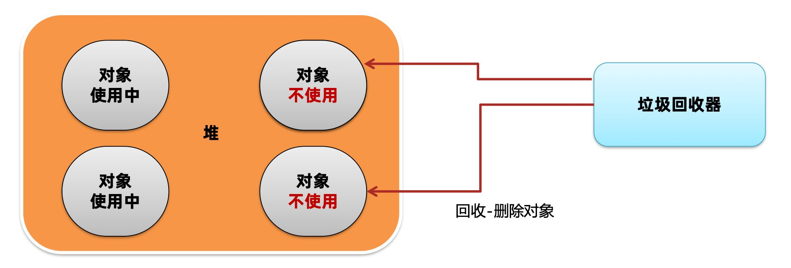
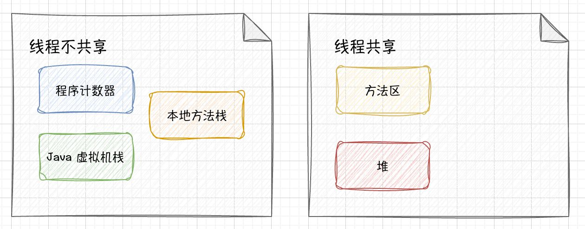
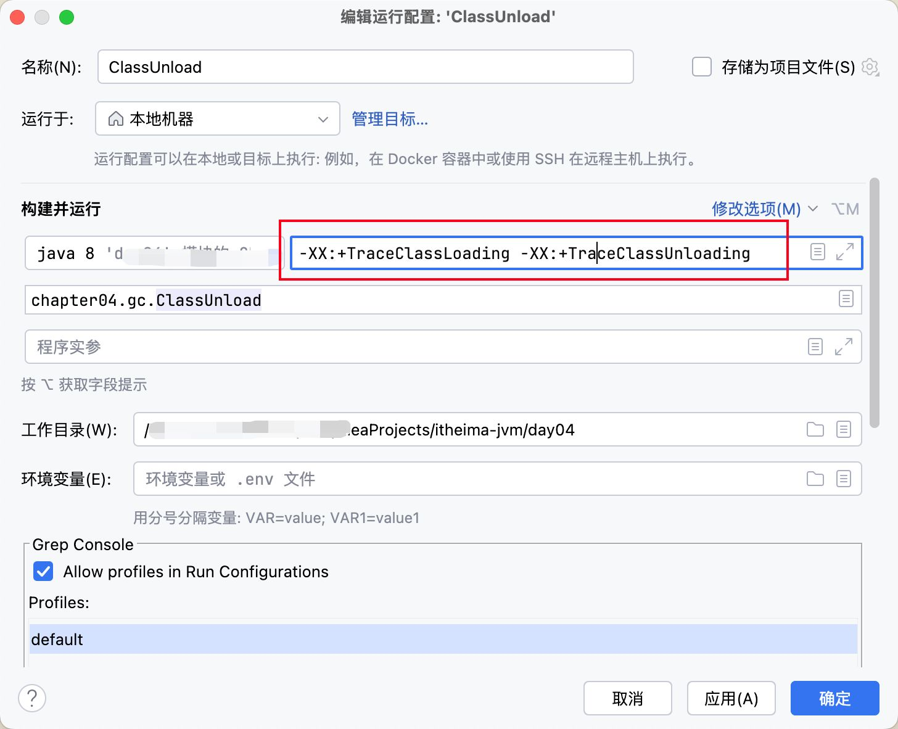
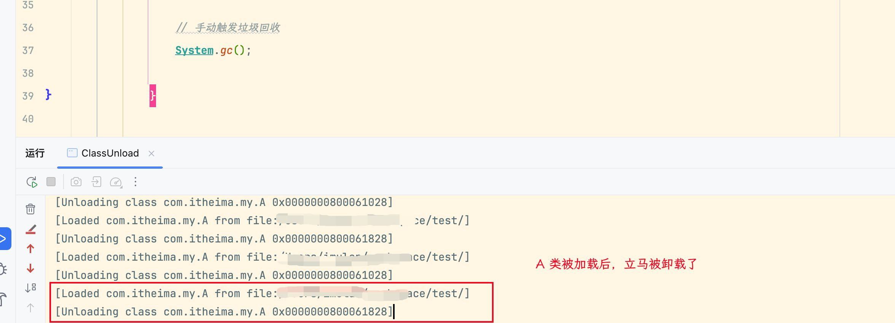
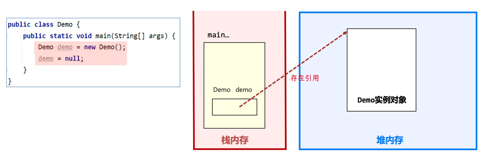
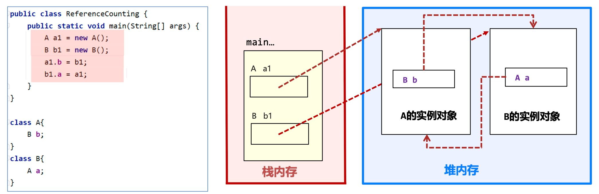
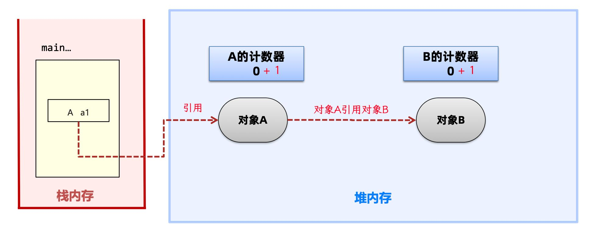
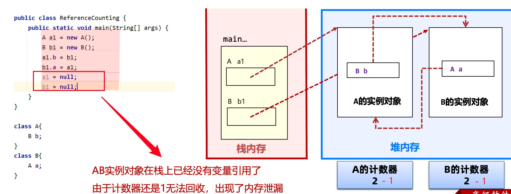
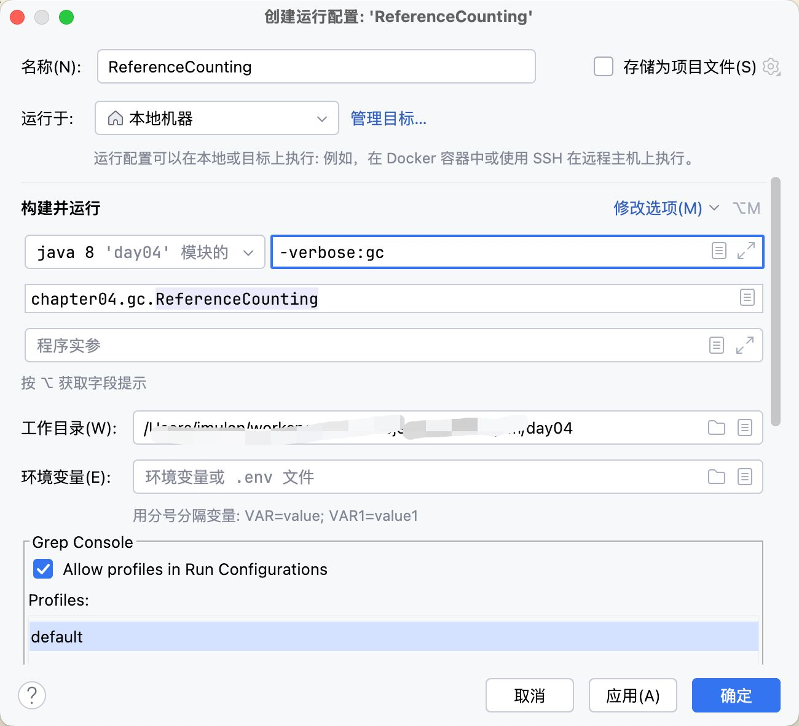
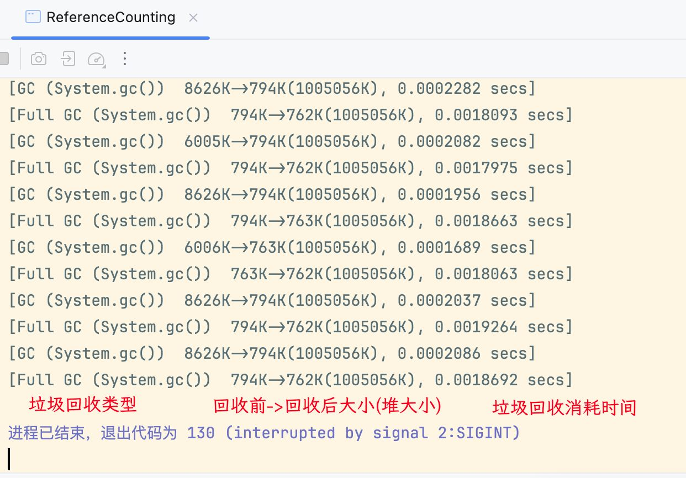

# 垃圾自动回收


> 在 C/C++ 这种没有自动垃圾回收机制的语言中，一个对象如果不再使用，则需要手动进行释放，否则会出现内存泄露；
> 
> 这种释放对象的过程叫做垃圾回收，需要编写代码进行回收的方式被称为**手动回收**；
> 
> **内存泄漏**：指的是不再使用的对象在系统中未被回收；内存泄漏的积累可能会导致内存溢出；


Java 中为了简化对象的释放，引入了自动**垃圾回收（Garbage Collection 简称 GC）机制**；通过垃圾回收器对不再使用的对象完成自动的回收，**垃圾回收器主要负责对堆上的内存进行回收**；如 C#、Python、Go 都拥有自己的垃圾回收器；



**自动与手动垃圾回收对比**：

- 自动垃圾回收：自动根据对象是否使用由虚拟机来回收对象；
	- 优点：**降低程序员实现难度** ，降低对象回收 bug 出现的可能性；
	- 缺点：程序员**无法控制垃圾回收的及时性**；
- 手动垃圾回收：由程序员编程实现对象的删除；
	- 优点：**回收及时性高**，由程序员把控回收的时机；
	- 缺点：编写不当容易出现**悬空指针**、**重复释放**、**内存泄漏**等问题；

再次回顾**运行时数据区**，基本结构如下：



[运行时数据区](./05_运行时数据区)中线程不共享的部分，是**伴随着线程的创建而创建，线程的销毁而销毁**；而方法的栈帧在执行完方法之后就*会自动弹出栈并释放掉对应的内存*；
## 方法区回收

> 方法区中能回收的内容主要是不再使用的类

判断一个类可以被卸载，需要同时满足以下 3 个条件：
1. 此**类所有实例对象都已经被回收**，在**堆中不存在任何该类的实例对象以及子类实例对象**；
2. 加载该类的类加载器已经被回收；
3. 该类对应的 `java.lang.Class` 对象没有被任何地方引用；

在 Java 程序运行中，可以添加虚拟机参数：`-XX:+TraceClassLoading`打印类加载日志，`-XX:+TraceClassUnloading`打印类被卸载的日志；



在代码中，可以调用`System.gc()`方法向虚拟机发送一个垃圾回收的请求（不一定会立即回收垃圾，只是发送请求），尝试手动触发垃圾回收；



> 开发中一般很少出现方法区类被卸载，主要是在 OSGI、JSP 等热部署应用场景中；如每个 JSP 文件对应一个唯一的类加载器，当一个 JSP 文件修改了，直接卸载这个 JSP 类加载器，重新创建类加载器，重新加载该 JSP 文件；


## 堆回收

Java 中的对象是否能被回收，是**根据对象是否被引用决定**；如果对象被引用了，则说明对象还在使用，不允许被回收；



因此一个对象被回收，需要判断堆上的对象是否还存在引用，如下所示出现循环引用的情况，则方法结束前 a1、b1 对象无法被回收；



若手动设置`a1=null; b1=null`则堆中 A、B 的对象实例可以被回收，因为**已经没有办法访问到这两个实例对象了**；

### 引用计数法和可达性分析法

> 判断堆上的对象是否被引用，常见有两种判断方法：引用计数法和可达性分析法

#### 引用计数法

引用计数法会为每个对象维护一个引用计数器，当对象被引用时加 1，取消引用时减 1；



如此 Java 虚拟机只用扫描回收堆中引用计数器等于 0 的对象实例即可；

引用计数法优点是实现简单，缺点主要有两点：
1. 每次引用和取消引用都**需要维护引用计数器**，对系统性能会有一定影响；
2. 存在**循环引用问题**，当出现循环引用（A 引用 B，B 引用 A）时会出现对象无法回收的情况；


在 Java 程序中添加虚拟机参数`-verbose:gc`可以查看垃圾回收日志；



运行下述代码：

```java
public class ReferenceCounting {  
    public static void main(String[] args) {  
        while (true) {  
            A a1= new A();  
            B b1 = new B();  
            a1.b = b1;  
            b1.a = a1;  
            a1 = null;  
            b1 = null;  
            // 向虚拟机发送 gc 请求  
            System.gc();  
        }  
    }  
}  
class A {  
    B b;  
    byte[] bytes = new byte[1024];  
}  
class B {  
    A a;  
    byte[] bytes = new byte[1024];  
}
```

查看控制台打印信息如下：



由上述结果也可以发现，Java 虚拟机并没有采用引用计数法；

#### 可达性分析法

