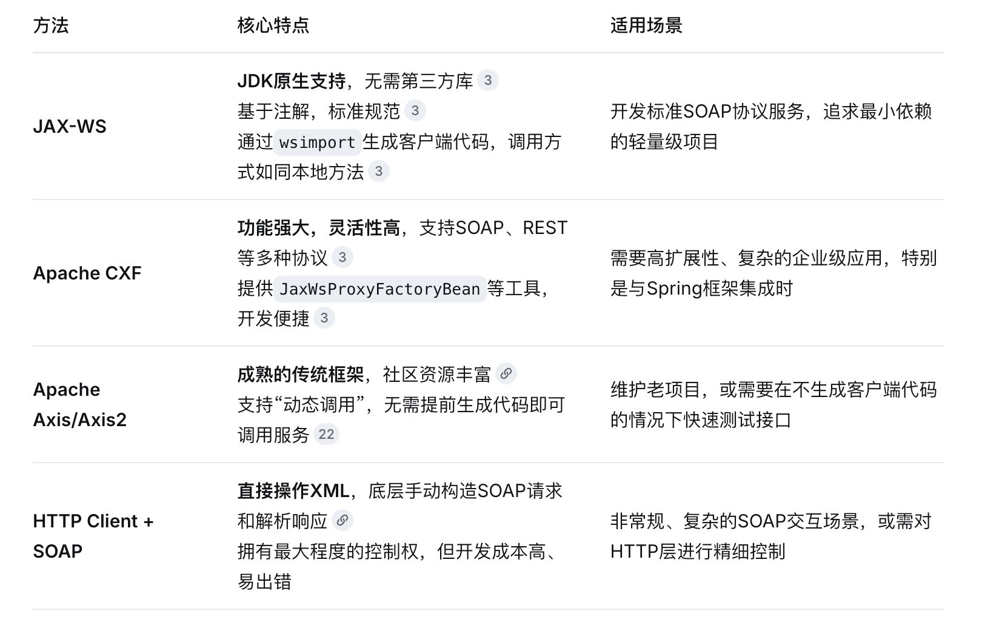
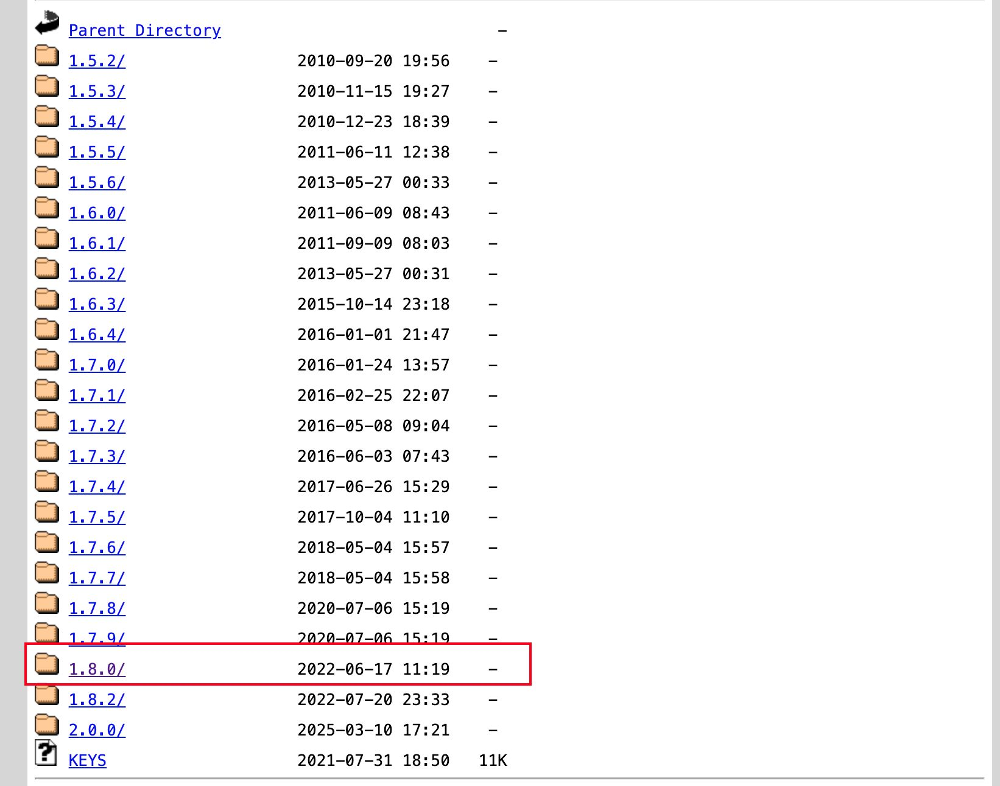
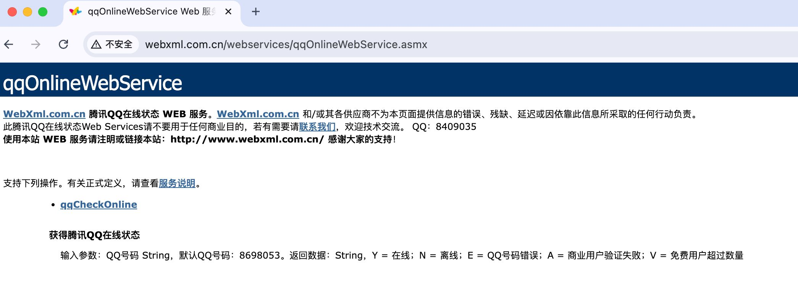
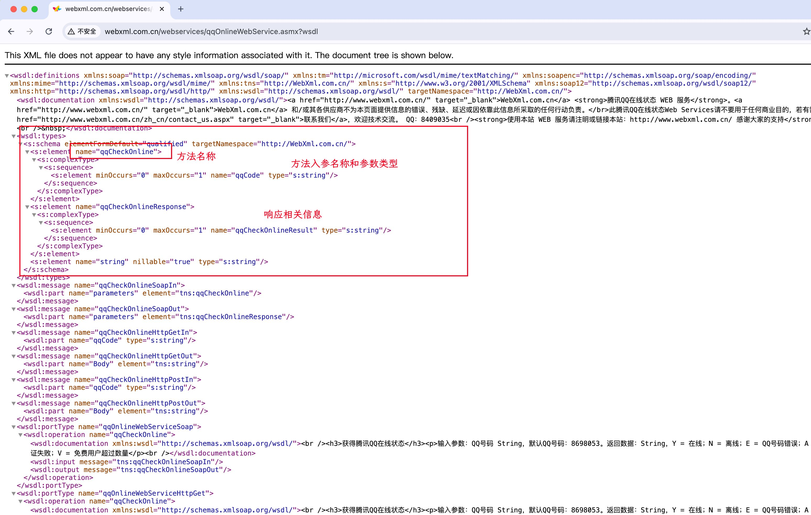
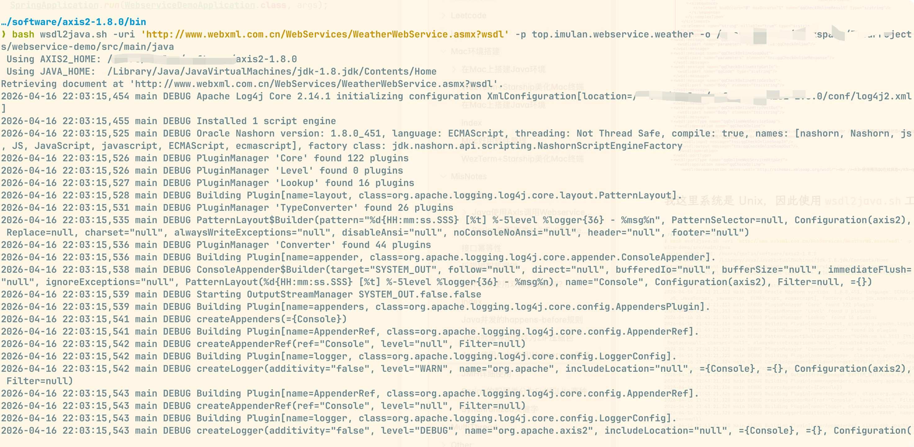
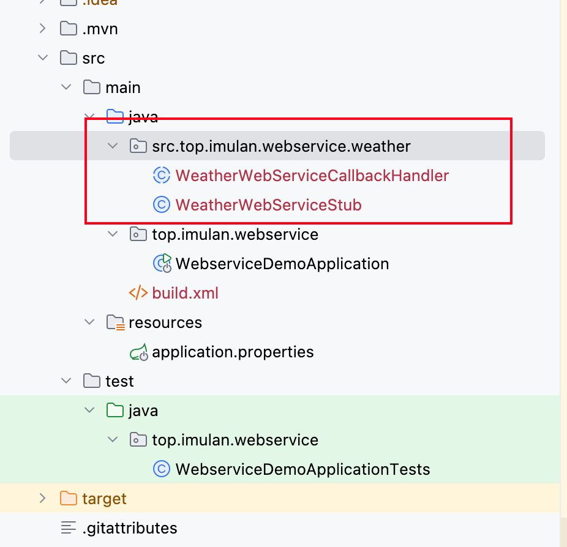
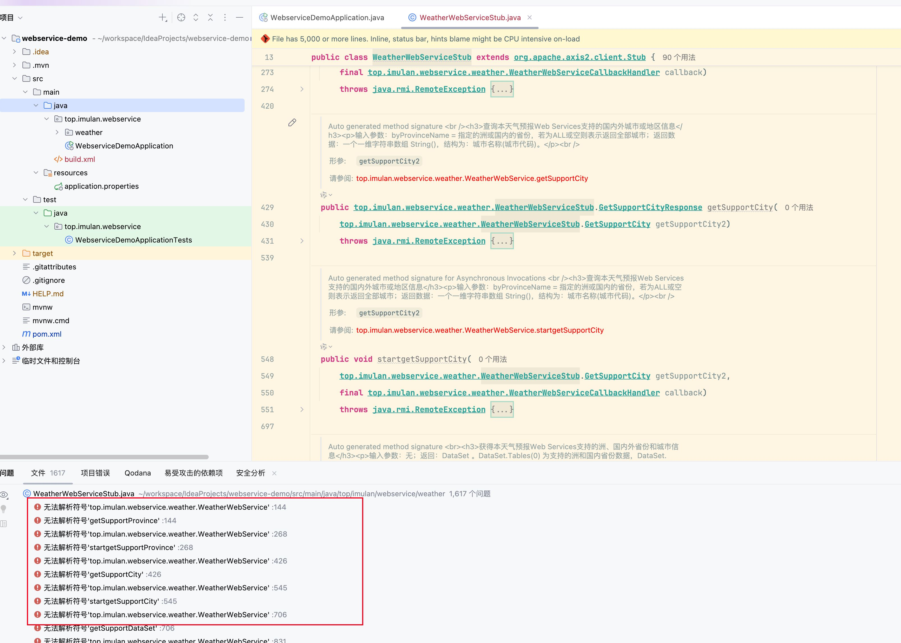
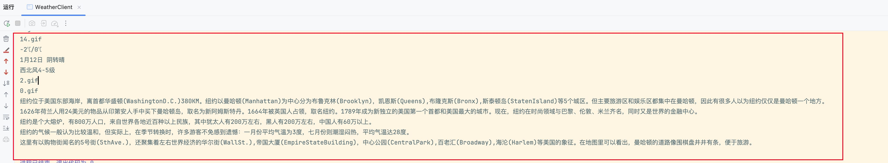
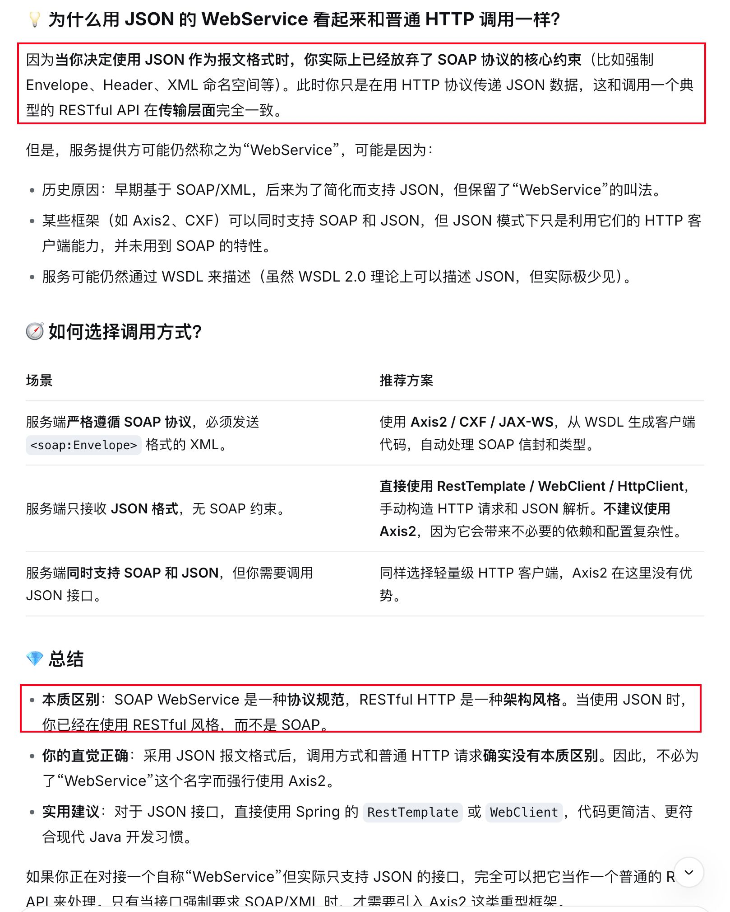

# Java 使用 Axis 调用 Webservice 服务


由于需要对接第三方系统，而第三方系统提供的是 Webservice 服务，因此需要了解如何使用 Java 调用 Webservice 服务；

## 调用方法选择

询问了 DeepSeek 之后得知，比较成熟的方案有四种，如下表所示：



由于之前有一个老项目使用了 Axis 1.4 来解析另一个项目的 Webservice，因此首选考虑使用 Axis，但是 Axis1 的最高版本就是 1.4，而且很早就已经不再维护了（已经老掉牙了）；

> [!TIP]
> 参考文章：[SpringBoot项目使用 axis 调用webservice接口（亲测可行）](https://juejin.cn/post/7109655800326389767)的方式支持使用 Axis1；

最终采用 [Axis2](https://archive.apache.org/dist/axis/axis2/java/core/)，且 JDK8 最多兼容 Axis1.8，直接下载 [axis2-1.8.0-bin.zip](https://archive.apache.org/dist/axis/axis2/java/core/1.8.0/axis2-1.8.0-bin.zip)文件；



## Axis2 使用步骤

解压下载的压缩包文件，使用 bin 目录中的`wsdl2java`工具可以直接生成可用的客户端代码，可以省略解析 xml 文件导致的可能运行时问题，相关调用和解析响应逻辑直接生成，我们可以**像调用本地方法一样，直接调用第三方提供 webservice 服务方法**；

在终端运行命令：`wsdl2java.bat -uri 提供的 webservice服务地址 -p 生产代码的包名 -o 生成客户端代码输出目录`即可；

> [示例源代码地址](https://github.com/ytahml/webservice-demo)

这里使用公共 webservice 服务作为示例：

- [QQ 用户在线状态检测](http://www.webxml.com.cn/WebServices/WeatherWS.asmx)
- [在线天气查询](http://www.webxml.com.cn/WebServices/WeatherWebService.asmx)



在服务地址路径后拼接`?wsdl`可以看到标准的 xml 格式信息：



我这里系统是 Unix，因此使用`wsdl2java.sh`工具，如下所示：



成功生成后，可以在项目中看到生成的代码：



由于生成的包目录中会自带 src 文件夹，多生成了一段，手动去掉即可；若我们需要调试代码，还需要在项目中引入 axis2 依赖：

```xml
<!-- Axis2 核心依赖 -->
<dependency>
    <groupId>org.apache.axis2</groupId>
    <artifactId>axis2-kernel</artifactId>
    <version>1.8.0</version>
</dependency>
<!-- 数据传输绑定方式，下面会详述 -->
<dependency>
    <groupId>org.apache.axis2</groupId>
    <artifactId>axis2-adb</artifactId>
    <version>1.8.0</version>
</dependency>
<!-- 传输协议支持 -->
<dependency>
    <groupId>org.apache.axis2</groupId>
    <artifactId>axis2-transport-http</artifactId>
    <version>1.8.0</version>
</dependency>
<!-- 本地调用传输发送器支持 -->  
<dependency>  
    <groupId>org.apache.axis2</groupId>  
    <artifactId>axis2-transport-local</artifactId>  
    <version>1.8.0</version>  
</dependency>
```

生成的代码可能会有一些语法问题，比如内部类型与 Java 自带的类型的转换问题，我们可以点开来大致看下错误，也可以等调用时再逐步调整;



接着就可以编写具体调用代码了，如下所示：

```java
import top.imulan.webservice.weather.WeatherWebServiceStub;  
  
/**  
 * * @author 花木凋零成兰  
 * @since 2026/4/16 22:06  
 */public class WeatherClient {  
    public static void main(String[] args) {  
        try {  
            // 1. 创建客户端对象，调用地址一般是去掉 ?wsdl 之后的地址，也可以在网页 xml 底部找到对应方法调用地址  
            WeatherWebServiceStub stub = new WeatherWebServiceStub("http://www.webxml.com.cn/WebServices/WeatherWebService.asmx");  
            // 2. 创建请求对象  
            WeatherWebServiceStub.GetWeatherbyCityName getWeather = new WeatherWebServiceStub.GetWeatherbyCityName();  
            getWeather.setTheCityName("New York");  
            // 3. 调用服务并获取响应  
            WeatherWebServiceStub.GetWeatherbyCityNameResponse response = stub.getWeatherbyCityName(getWeather);  
            // 返回结果，并转化为 Java 类型  
            String[] result = response.getGetWeatherbyCityNameResult().getString();  
            // 4. 输出结果  
            for (String str : result) {  
                System.out.println(str);  
            }  
        } catch (Exception e) {  
            e.printStackTrace();  
        }  
    }  
}
```

执行结果如下所示：


## SpringBoot 整合 Axis2

Stub 对象是线程安全的，因此我们可以将 Stub 对象由 Spring 容器管理，避免反复创建的开销，如下所示：

```java
import org.apache.axis2.AxisFault;  
import org.apache.axis2.client.Options;  
import org.apache.axis2.transport.http.HTTPConstants;  
import org.springframework.context.annotation.Bean;  
import org.springframework.context.annotation.Configuration;  
import top.imulan.webservice.weather.WeatherWebServiceStub;  
  
/**  
 * * @author 花木凋零成兰  
 * @since 2026/4/16 22:15  
 */@Configuration  
public class WebServiceConfig {  
    @Bean  
    public WeatherWebServiceStub weatherWebServiceStub() {  
        try {  
            // 1. 创建客户端对象，调用地址一般是去掉 ?wsdl 之后的地址，也可以在网页 xml 底部找到对应方法调用地址  
            WeatherWebServiceStub stub = new WeatherWebServiceStub("http://www.webxml.com.cn/WebServices/WeatherWebService.asmx");  
            // 2. 配置相关属性  
            Options options = stub._getServiceClient().getOptions();  
            // 3. 设置超时时间（单位：毫秒）区分连接超时和 Socket 超时，比 setTimeOutInMilliSeconds 更精确  
            // 连接超时 30 秒  
            options.setProperty(HTTPConstants.CONNECTION_TIMEOUT, 30000);  
            // Socket 超时 60 秒  
            options.setProperty(HTTPConstants.SO_TIMEOUT, 60000);  
            // 4. 复用 HTTP 连接，节省资源开销，提高性能  
            options.setProperty(HTTPConstants.REUSE_HTTP_CLIENT, "true");  
            return stub;  
        } catch (AxisFault e) {  
            throw new RuntimeException("初始化天气 Webservice 客户端失败：" + e.getMessage(), e);  
        }  
    }  
}
```

接下来我们只需要调用本地 Servcie 服务一样，正常调用方法接口即可，如下所示：

```java
/**  
 * * @author 花木凋零成兰  
 * @since 2026/4/16 22:20  
 */@Service  
public class WeatherService {  
    @Autowired  
    private WeatherWebServiceStub weatherWebServiceStub;  
      
    public String[] getWeatherByCityName(String city) throws RemoteException {  
        // 2. 创建请求对象  
        WeatherWebServiceStub.GetWeatherbyCityName getWeather = new WeatherWebServiceStub.GetWeatherbyCityName();  
        getWeather.setTheCityName("New York");  
        // 3. 调用服务并获取响应  
        WeatherWebServiceStub.GetWeatherbyCityNameResponse response = weatherWebServiceStub.getWeatherbyCityName(getWeather);  
        // 返回结果，并转化为 Java 类型  
        return response.getGetWeatherbyCityNameResult().getString();  
    }  
}
```

## 后记

由于当时了解 Webservice 时，第三方系统还没提供正式的接口，后续查看第三方系统提供的服务接口文档，提到采用 Webservice 协议，**传输报文使用 JSON 格式**；

就感觉很奇怪，这样和平常使用 HTTP 请求有什么区别？DeepSeek 大概解释如下：



虽然可能最后还是和平常对接第三方 HTTP 接口一样去发送 JSON 数据，响应解析 JSON 数据一样，但也算是了解了下严格的 SOAP 协议的 Webservice 服务基本对接流程了；

## 参考文章

- [JAVA调用Web Service接口的五种方式](https://zhuanlan.zhihu.com/p/394377813)
- [SpringBoot项目使用 axis 调用webservice接口（亲测可行）](https://juejin.cn/post/7109655800326389767)
