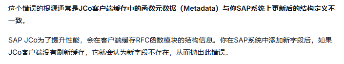
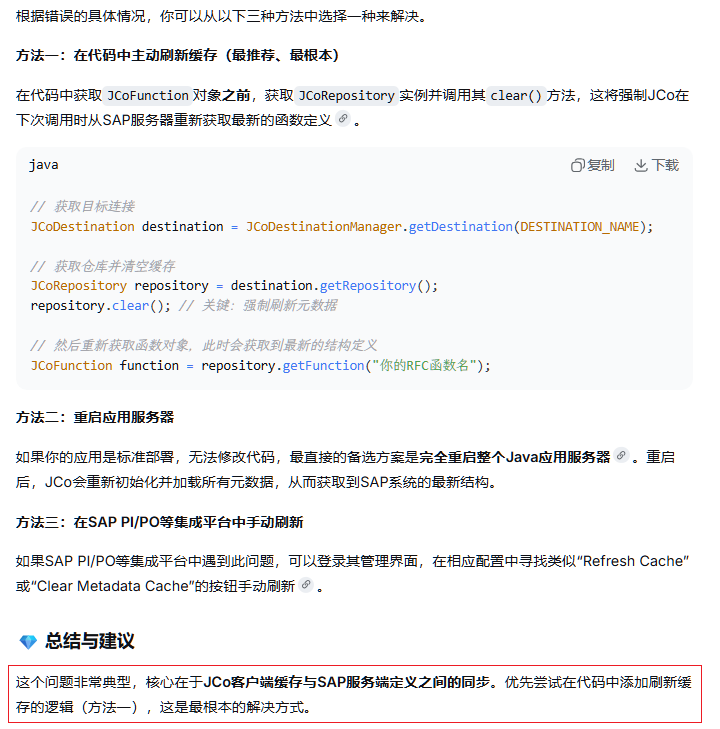
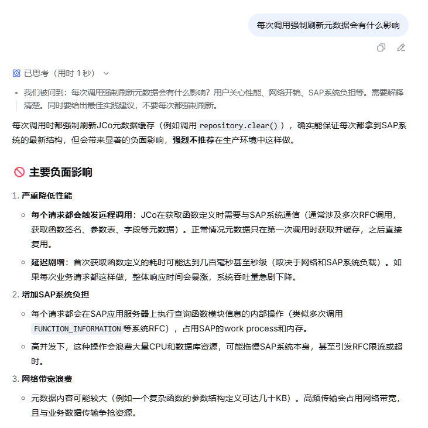

# JCo 连接 SAP 出现 Field XXX not a member of XXX 错误

## 问题背景

项目有一个对接 SAP 系统的接口要调整, 需要新增几个字段, 在测试环境调试好之后推上正式环境却出现了如下错误:

> >>>>>java.lang.RuntimeException: com.sap.conn.jco.JCoRuntimeException: Field XXX not a member of XXX
> 
> com.sap.conn.jco.JCoRuntimeException: (127) JCO_ERROR_FIELD_NOT_FOUND : Field XXX not a member of XXX
> 
> at com.sap.conn.jco.rt.AbstractMetaData.indexOf(AbstractMetaData.java:377)
> 
> at com.sap.conn.jco.rt.AbstractRecord.setValue(AbstractRecord.java:3670)
> 

## 问题排查

首先是验证正式环境SAP接收字段是不是和测试环境不一致, 确认后发现字段一致;

感觉十分神奇, 因为除了新增的字段之外, 其他代码都没有动, 测试环境可以正式环境应该也没问题才对; DeepSeek 回答如下所示:

**JCo 会缓存 SAP 的函数元数据, 而且不会自动刷新缓存, 只会在每次项目启动时会更新**;

## 解决方案

DeepSeek 提供了三种方案, 优先尝试重启服务试试, 接着考虑是否采取方案一;

经过服务重启之后, 再次尝试调用 SAP 函数接口, 发现没有问题了, 权衡考虑, 因为对 JCO 的不熟悉只能后续有机会再尝试方案一了;

## 总结

回顾整个开发流程, 确实是系统上线运行了一段时间, 后续有用户尝试功能发现不行, 当时 SAP 那边还没有更新正式环境, 后续更新了之后功能依旧不行;

即两边系统存在功能上线的先后性问题, 那么在存在不会自动更新的缓存的基础上, 就会造成这种"神奇"问题; 

对于方案一的代码方案, 目前没有办法确认是否可行, 此外还需要评估每次调用就删掉缓存造成的功能性、用户体验影响,  日后有机会学习了解; 可以考虑在系统手动加一个开关来控制;

此外也有其他前辈大佬早就有过这个问题, 大部分采取的方案似乎只有重启:

- [Runtime exception JCO_ERROR_FIELD_NOT_FOUND](https://community.sap.com/t5/technology-q-a/runtime-exception-jco-error-field-not-found/qaq-p/10796769)
- [Domino 连接SAP问题](https://www.talkwithtrend.com/Question/400231)
- [Why does SAP JCo raise an error "Field ... not a member of ..." even though the field exists?](https://browse.library.kiwix.org/content/stackoverflow.com_en_all_2023-11/questions/39639546/why-does-sap-jco-raise-an-error-field-not-a-member-of-even-though-the-field-ex)

